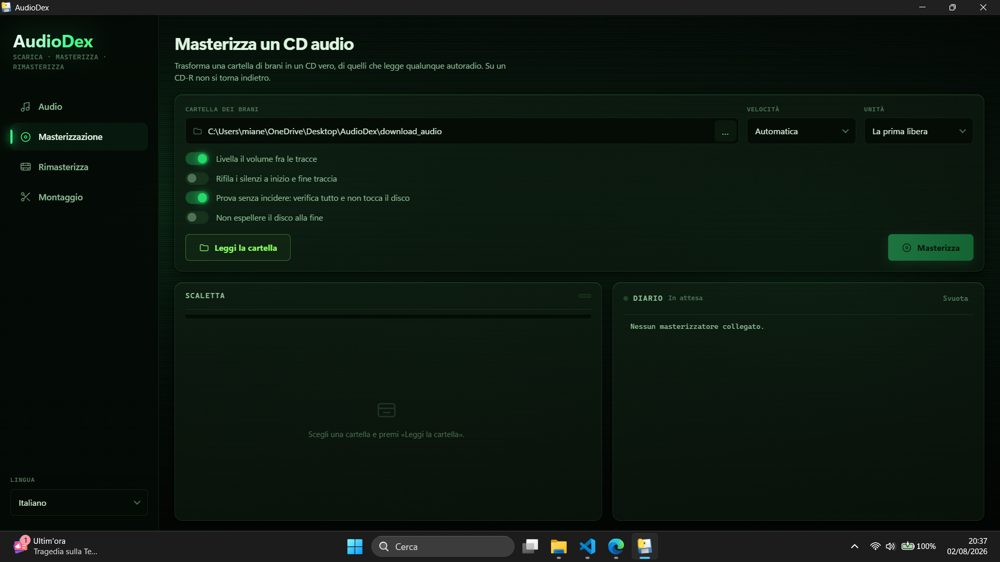

<div align="center">



# 🎧 MediaDex

<b>AudioDex</b> · <b>BurnDex</b> · <b>PixDex</b> · <b>ClipDex</b><br>
<i>quattro strumenti, una finestra sola</i>

<p align="center">
  
  
  
  
  
  
  
  
  
  
  
  
  
  
  
  
  
  
  
  
  
  
</p>

<p align="center">
  Cerca brani su <b>YouTube</b> e scaricane il <b>solo flusso audio</b> — o il <b>video intero</b>,<br>
  te lo chiede prima di partire: file di pochi MB, <b>qualità originale</b>, nessuna ricodifica.<br>
  Ogni traccia arriva già <b>taggata</b> (titolo, artista, album, copertina) e con il<br>
  <b>testo sincronizzato in stile karaoke</b> dentro il file, pronta da copiare sul telefono.<br>
  <b>Playlist intere</b> in una cartella ordinata, <b>download paralleli</b> con barre live.<br>
  <b>Niente account, niente pubblicità, niente limiti di durata.</b>
</p>

<p align="center">
  <b>E quando l'ascolto è in auto</b>, <code>BurnDex.py</code> trasforma una raccolta scaricata in un<br>
  <b>CD audio vero</b> (Red Book CD-DA), leggibile da qualsiasi autoradio e stereo datato:<br>
  API native di Windows, nessun programma di masterizzazione esterno.
</p>

<p align="center">
  🇮🇹 <b>Italiano</b>  ·  <a href="README.en.md">🇬🇧 English</a>
</p>

</div>

**Scarica** [**`AudioDex.exe`**](https://github.com/Imkun-on/MediaDex/releases/latest) e fai doppio clic: niente Python da installare, nessun file `.py` in vista. Serve solo FFmpeg, che si mette una volta sola — e il programma te lo ricorda da solo se manca:

```bash
winget install Gyan.FFmpeg
```

<details>
<summary><b>⚠️ Windows dice «AudioDex.exe non viene scaricato di frequente». È un virus?</b></summary>

<br>

**No, e Windows non sta dicendo che lo sia.** Quella frase è esattamente ciò che afferma:
questo file è nuovo e poche persone lo hanno scaricato. Il controllo si chiama
**SmartScreen** e non guarda dentro il file: guarda quanto è *conosciuto*. Un programma
appena pubblicato non è conosciuto da nessuno, quindi lo stesso avviso comparirebbe su
un eseguibile perfettamente innocuo — come questo — e non comparirebbe su un malware
diffuso da mesi.

L'avviso sparisce da solo in due modi, e nessuno dei due dipende da cosa c'è nel programma:
quando abbastanza persone lo scaricano senza segnalarlo, oppure se l'eseguibile viene
**firmato** con un certificato di code signing (da ~100 €/anno per uno OV, che comunque
richiede di accumulare reputazione; un certificato EV la dà subito, ma costa parecchio di più).
Per un progetto non commerciale come questo, pagare un certificato per far sparire un
avviso non ha molto senso.

**Come procedere:**

1. Nella barra dei download del browser, accanto al file: `···` → **Mantieni** →
   **Mantieni comunque**.
2. Al primo doppio clic, se compare la finestra blu: **Ulteriori informazioni** →
   **Esegui comunque**.

**Se preferisci verificare invece che fidarti** — ed è la scelta giusta con qualunque
eseguibile preso da internet:

```powershell
Get-FileHash .\AudioDex.exe -Algorithm SHA256
```

L'impronta deve coincidere con quella pubblicata nelle note della
[Release](https://github.com/Imkun-on/MediaDex/releases/latest). Se coincide, il file
che hai è bit per bit quello costruito da questi sorgenti. In alternativa puoi caricarlo
su [VirusTotal](https://www.virustotal.com/), o saltare del tutto l'eseguibile e
**partire dai sorgenti** con le tre righe qui sotto: sono lo stesso programma.

</details>

**Oppure dai sorgenti**, se vuoi metterci le mani:

```bash
git clone https://github.com/Imkun-on/MediaDex.git
cd MediaDex
pip install -r requirements.txt
```

> 🎞️ **Il video di sfondo della GUI non è nel repository** (pesa 74 MB e rallenterebbe ogni
> `git clone`): sta come allegato della [Release `assets-v1`](https://github.com/Imkun-on/MediaDex/releases/tag/assets-v1)
> e viene scaricato **una volta sola al primo avvio**, in background. La finestra si apre subito:
> finché il download non è finito — o se non riesce — lo sfondo sono i gradienti verdi del tema, che reggono benissimo da soli.

---

## 📖 Indice

**Capitolo 1 — [📋 Descrizione del progetto](#-descrizione-del-progetto)**

**Capitolo 2 — [🆚 Perché AudioDex e non i soliti convertitori online](#-perché-audiodex-e-non-i-soliti-convertitori-online)**

**Capitolo 3 — [✨ Caratteristiche](#-caratteristiche)**

**Capitolo 4 — [📦 Requisiti e installazione](#-requisiti-e-installazione)**
- 4.1 [Python](#python)
- 4.2 [FFmpeg (obbligatorio)](#ffmpeg-obbligatorio)
- 4.3 [Dipendenze Python](#dipendenze-python)
- 4.4 [🌍 Lingua dell'interfaccia](#-lingua-dellinterfaccia)

**Capitolo 5 — [🚀 Uso ed esempi](#-uso-ed-esempi)**
- 5.1 [Il flusso interattivo, passo per passo](#il-flusso-interattivo-passo-per-passo)
- 5.2 [Esempio 1 — Ricerca per nome](#esempio-1--ricerca-per-nome)
- 5.3 [Esempio 2 — Download di una playlist](#esempio-2--download-di-una-playlist)
- 5.4 [Esempio 3 — La scheda di un video singolo](#esempio-3--la-scheda-di-un-video-singolo)
- 5.5 [Esempio 4 — Uso da riga di comando](#esempio-4--uso-da-riga-di-comando)

**Capitolo 6 — [🔧 Opzioni della riga di comando](#-opzioni-della-riga-di-comando)**
- 6.1 [Playlist private](#playlist-private)

**Capitolo 7 — [🔀 Come funziona il download](#-come-funziona-il-download)**
- 7.1 [Ricerca](#1-ricerca)
- 7.2 [Normalizzazione degli URL playlist](#2-normalizzazione-degli-url-playlist)
- 7.3 [Download: audio o video](#3-download-audio-o-video)
- 7.4 [Parallelismo e avanzamento](#4-parallelismo-e-avanzamento)
- 7.5 [Anti-duplicati e retry](#5-anti-duplicati-e-retry)

**Capitolo 8 — [🖼️ Copertina e volume, in automatico](#copertina-e-volume-in-automatico)**

**Capitolo 9 — [📀 Album interi divisi in tracce](#-album-interi-divisi-in-tracce)**

**Capitolo 10 — [🔢 L'ordine delle tracce](#-lordine-delle-tracce)**
- 8.1 [Il problema](#il-problema)
- 8.2 [Come viene risolto](#come-viene-risolto)
- 8.3 [Selezioni parziali e playlist con buchi](#selezioni-parziali-e-playlist-con-buchi)
- 8.4 [Numerazione dei file già scaricati](#numerazione-dei-file-già-scaricati)

**Capitolo 11 — [🧾 Tagging dei metadati](#-tagging-dei-metadati)**

**Capitolo 12 — [🎵 Testi sincronizzati (karaoke)](#-testi-sincronizzati-karaoke)**

**Capitolo 13 — [💾 Formati di output](#-formati-di-output)**

**Capitolo 14 — [💿 BurnDex — masterizzare un CD audio](#-burndex--masterizzare-un-cd-audio)**
- 12.1 [A cosa serve e perché un CD audio](#a-cosa-serve-e-perché-un-cd-audio)
- 12.2 [Requisiti aggiuntivi](#requisiti-aggiuntivi)
- 12.3 [Il flusso in quattro passi](#il-flusso-in-quattro-passi)
- 12.4 [Opzioni della riga di comando](#opzioni-della-riga-di-comando-burndex)
- 12.5 [Cosa succede all'audio prima di incidere](#cosa-succede-allaudio-prima-di-incidere)
- 12.6 [L'ordine delle tracce sul disco](#lordine-delle-tracce-sul-disco)
- 12.7 [Tipologie di disco riconosciute](#tipologie-di-disco-riconosciute)
- 12.8 [Riconoscimento del sistema](#riconoscimento-del-sistema)
- 12.9 [Come funziona la scrittura (IMAPI2)](#come-funziona-la-scrittura-imapi2)
- 12.10 [I limiti del CD audio](#i-limiti-del-cd-audio)
- 12.11 [Diagnosi degli errori](#diagnosi-degli-errori)

**Capitolo 15 — [🎞 PixDex — rimasterizzare un video](#-pixdex--rimasterizzare-un-video)**
- 13.1 [A cosa serve, e soprattutto cosa non fa](#a-cosa-serve-e-soprattutto-cosa-non-fa)
- 13.2 [Perché funziona lo stesso](#perché-funziona-lo-stesso)
- 13.3 [L'ordine dei filtri non è negoziabile](#lordine-dei-filtri-non-è-negoziabile)
- 13.4 [I cinque preset](#i-cinque-preset)
- 13.5 [Come è tarata la sbandatura](#come-è-tarata-la-sbandatura)
- 13.6 [La diagnosi](#la-diagnosi)
- 13.7 [Fin dove ingrandisce, e come sceglierlo](#fin-dove-ingrandisce-e-come-sceglierlo)
- 13.8 [Il confronto prima/dopo](#il-confronto-primadopo)
- 13.9 [Codifica: software o GPU](#codifica-software-o-gpu)
- 13.10 [Opzioni della riga di comando](#opzioni-della-riga-di-comando-pixdex)
- 13.11 [Nella GUI](#nella-gui)

**Capitolo 16 — [✂ ClipDex — tagliare, unire, convertire](#-clipdex--tagliare-unire-convertire)**
- 15.1 [Copia o ricodifica](#copia-o-ricodifica-è-la-scelta-che-governa-tutto)
- 15.2 [`taglia`](#taglia--estrarre-uno-spezzone)
- 15.3 [`unisci`](#unisci--mettere-in-fila-più-file)
- 15.4 [`gif` e `webp`](#gif-e-webp--ricavare-unanimazione)
- 15.5 [`provino`](#provino--capire-cosa-cè-dentro)
- 15.6 [`compat`](#compat--farlo-leggere-agli-apparecchi-datati)

**Capitolo 17 — [📦 Un solo file: AudioDex.exe](#-un-solo-file-audiodexexe)**

**Capitolo 18 — [🧩 Architettura del progetto](#-architettura-del-progetto)**

**Capitolo 19 — [📊 Database globale](#-database-globale)**

**Capitolo 20 — [🧯 Gestione degli errori e tracce fallite](#-gestione-degli-errori-e-tracce-fallite)**

**Capitolo 21 — [📚 Librerie usate e perché](#-librerie-usate-e-perché)**

**Capitolo 22 — [📝 Changelog](#-changelog)**

**Capitolo 23 — [📜 Note legali](#-note-legali)**

**Capitolo 24 — [📄 Licenza](#-licenza)**

---

## 📋 Descrizione del progetto

**AudioDex** è uno strumento da terminale che trasforma un link YouTube in **file audio veri**: taggati, con copertina, con il testo dentro e ordinati come li vuoi tu.

L'idea nasce da un fastidio concreto: i convertitori online promettono "YouTube → MP3", ma poi ti servono tre clic su banner pubblicitari, il file esce senza titolo né copertina, e per un album da 12 tracce devi ripetere tutto 12 volte — ritrovandoti sul telefono una cartella di brani in ordine casuale. AudioDex fa lo stesso lavoro in un comando, per **una playlist intera**, e restituisce file già pronti per la libreria musicale.

Puoi scegliere **cosa** scaricare:

- 🔍 **cercando per nome**: digiti "linkin park in the end", scegli dai risultati in tabella;
- 📺 **un video singolo**, incollandone l'URL;
- 💿 **un'intera playlist o album**, che finisce in una **sottocartella con il suo nome**, con le tracce **numerate nell'ordine originale**.

E cosa ottieni per ogni brano:

- 🎚️ **la sola traccia audio** (`m4a`, `mp3` o `opus`): pochi MB invece di centinaia, a parità di qualità sonora — oppure il **video intero** (`mp4`, `mkv`) se lo chiedi;
- 🧾 **metadati completi**: titolo, artista, album, numero di traccia e **copertina** incorporata;
- 🎤 **il testo sincronizzato** in stile karaoke, dentro il file stesso (nessun `.lrc` sparso);
- 📱 **un nome file pulito**, senza emoji né caratteri strani: si copia sul telefono via USB senza errori.

Lo strumento è pensato per:

- 🎧 **Chi si costruisce una libreria musicale offline** ordinata e taggata come si deve
- 📱 **Chi ascolta dal telefono** senza abbonamento e senza connessione
- 💿 **Chi scarica album e playlist interi** e vuole ritrovarli nell'ordine giusto

---

## 🆚 Perché AudioDex e non i soliti convertitori online

I siti "YouTube to MP3" sono gratuiti solo in apparenza. Nella pratica:

- ti fanno cliccare su **pubblicità travestite** da pulsante di download;
- impongono un **tetto di durata** (spesso 10-20 minuti) o **una traccia alla volta**;
- restituiscono file **senza tag e senza copertina**, chiamati `video_1.mp3`;
- **ricodificano** l'audio in 128 kbps, peggiorandolo rispetto all'originale;
- per una playlist ti chiedono l'**account** o il piano **premium**.

AudioDex nasce per togliere di mezzo tutto questo:

| | Tipico convertitore online | **AudioDex** |
|---|---|---|
| **Costo reale** | gratis → poi premium / pubblicità invasiva | **gratis davvero**, gira sul tuo PC |
| **Playlist intere** | a pagamento o assenti | **sì**, in una cartella ordinata |
| **Durata massima** | spesso 10-20 min | **nessun limite** |
| **Qualità audio** | ricodifica a 128 kbps | **flusso originale**, `m4a` senza ricodifica |
| **Tag e copertina** | quasi mai | **sempre** (titolo, artista, album, traccia, cover) |
| **Testo del brano** | no | **sincronizzato, dentro il file** |
| **Ordine delle tracce** | casuale | **quello della playlist**, numerato |
| **Account obbligatorio** | frequente | **no** |
| **Download paralleli** | no | **sì** (3 di default, configurabili) |
| **Open source** | mai | **sì** |

In breve: **lo controlli tu**, gira sul **tuo computer**, e i file che ottieni sono quelli che avresti comprato.

---

## ✨ Caratteristiche

- 🔍 **Ricerca su YouTube per nome** di canzone o artista, con risultati in tabella numerata e selezione flessibile: numero singolo, intervallo (`1-5`), elenco (`1,3,7`) o `all`. Le colonne separano **titolo** e **artista** (ricavato dal formato `Artista - Brano` o dal canale), con durata e views quando disponibili
- 🎬 **Scheda del video prima di scaricare**: incollando l'URL di un video singolo compare un pannello con canale, **visualizzazioni, mi piace, iscritti**, categoria, lingua, data di pubblicazione, durata e numero di capitoli — poi ti viene chiesta conferma
- 💿 **Scheda della playlist**: canale, numero di tracce, durata totale, visualizzazioni complessive, data dell'ultimo aggiornamento e visibilità (pubblica / non in elenco), più l'avviso di quanti video sono **privati o rimossi**
- 📋 **Elenco completo delle tracce di una playlist** prima della conferma, con le stesse colonne della ricerca
- 🔗 **Download diretto da URL** di video singoli, playlist e album (YouTube `playlist?list=`, link con `&list=`, e riconoscimento dei pattern playlist di Spotify/SoundCloud)
- 🎚️ **Audio o video, lo scegli tu**: di default viene scaricato il solo flusso `bestaudio` e convertito nel formato scelto (`m4a`, `mp3`, `opus`) — un brano occupa pochi MB invece di centinaia. Serve il video intero? In modalità interattiva il programma **te lo chiede** prima di partire, e da riga di comando c'è `--media video` (`mp4` o `mkv`)
- ⚡ **Download paralleli** con pool di thread configurabile (default 3) e **avanzamento live su tre livelli**: una barra complessiva sulle tracce, **una barra per ciascuna delle quattro fasi** (Download, Conversione, Testi, Tag) e una barra per ogni file in corso con velocità e tempo stimato
- 🧾 **Tagging automatico dei metadati**: titolo, artista, album, numero traccia e **copertina** incorporata nel file (via mutagen)
- 🎤 **Testi sincronizzati stile karaoke**: per ogni traccia viene cercato il testo con i timestamp su [LRCLIB](https://lrclib.net) e **incorporato nei tag del file audio** — un file unico che porta con sé anche il testo; i lettori compatibili lo mostrano riga per riga mentre il brano suona
- 🔢 **Ordine della playlist rispettato**: i file vengono salvati con il **numero di traccia in testa al nome** (`01 - Brano.m4a`), così sul disco e sul telefono restano nell'ordine originale anche se i download finiscono in ordine sparso (vedi il [capitolo 8](#-lordine-delle-tracce))
- 💿 **Playlist organizzate**: ogni playlist/album finisce in una sottocartella con il suo nome
- ♻️ **Anti-duplicati**: le tracce già presenti su disco vengono saltate (`skip`), così si può rilanciare lo stesso download senza riscaricare nulla
- 🔁 **Retry automatici** con backoff esponenziale e jitter (fino a 4 tentativi per traccia)
- 📱 **Nomi file compatibili con i telefoni**: niente emoji né caratteri Unicode a tutta larghezza (`⧸ ： ｜`), che fanno fallire la copia via cavo USB
- 📊 **Database SQLite globale** che registra ogni download (titolo, artista, album, dimensione, durata, formato, data)
- 📄 **Esportazione delle tracce fallite** in `failed_tracks.txt` con gli URL pronti per ritentare
- 🛑 **Arresto pulito con Ctrl+C**: i download in corso terminano, quelli in coda vengono annullati; un secondo Ctrl+C forza l'uscita
- 💽 **Controllo dello spazio disco** prima di iniziare, con richiesta di conferma sotto i 200 MB liberi
- 💿 **Masterizzazione su CD audio** con [BurnDex](#-burndex--masterizzare-un-cd-audio): una raccolta scaricata diventa un **CD-DA** leggibile da qualsiasi autoradio, tramite le API native di Windows. Riconosce il tipo di disco inserito, distingue le unità interne da quelle USB, e con `--dry-run` prova tutto senza consumare un CD-R

---

## 📦 Requisiti e installazione

### Python

Richiede **Python 3.10+**.

### FFmpeg (obbligatorio)

FFmpeg estrae e converte l'audio nel formato scelto: senza, il download non può completarsi. Su Windows:

```powershell
winget install Gyan.FFmpeg
```

Su macOS:

```bash
brew install ffmpeg
```

Su Linux (Debian/Ubuntu):

```bash
sudo apt install ffmpeg
```

In alternativa scaricalo da [gyan.dev](https://www.gyan.dev/ffmpeg/builds/) e aggiungilo al `PATH`. Verifica con `ffmpeg -version`.

### Dipendenze Python

```bash
pip install -r requirements.txt
```

oppure manualmente:

```bash
pip install yt-dlp requests rich mutagen
pip install pywin32          # solo per BurnDex (masterizzazione CD, Windows)
```

> ⚠️ **Nota su yt-dlp:** YouTube cambia spesso le proprie API interne. Se ricerca o download smettono di funzionare, quasi sempre basta aggiornare: `pip install -U yt-dlp`

> 💿 **`pywin32` serve solo a BurnDex** e solo su Windows. AudioDex funziona senza. Se manca, `BurnDex.py --dry-run` esegue comunque tutti i controlli sulla scaletta e si limita a saltare l'interrogazione dell'unità.

### 🌍 Lingua dell'interfaccia

**Da terminale si lavora in italiano.** I tre programmi a riga di comando — `AudioDex.py`, `BurnDex.py`, `PixDex.py` — parlano italiano e basta: nessuna domanda all'avvio, nessuna opzione `--lang` da ricordare. Apri il terminale, lanci, parti.

**Nella GUI la scelta c'è, ed è un clic.** `AudioDexApp.py` ha un menu a tendina **Italiano / English** nella barra laterale: cambia lingua all'istante — voci di menu, etichette, pulsanti, diagnosi, messaggi — e ricorda la scelta in `settings.json` per i lanci successivi.

È lì che la scelta ha senso. Un menu a tendina lo vedi, lo provi e ne cogli subito l'effetto; la stessa scelta come argomento da digitare era solo una cosa in più da ricordare a ogni lancio.

**Cosa non viene tradotto.** I file di log in `logs/` e i commenti nel codice restano in italiano: servono a chi mantiene il programma, non a chi lo usa.

> 🗣 **Le risposte funzionano in entrambe le lingue.** `s` e `y` valgono entrambe come conferma, `q` ed `esci` come uscita: chi digita `y` per abitudine non si vede annullare l'operazione.

---

## 🚀 Uso ed esempi

```bash
python AudioDex.py
```

### Il flusso interattivo, passo per passo

1. **Avvio**: banner, controllo dello spazio disco, inizializzazione del database
2. **Cerca o incolla**: digita un nome di canzone/artista per cercare, oppure incolla direttamente un URL
3. **Selezione**: scegli quali risultati scaricare (numero, intervallo, elenco, `all`)
4. **Download**: le tracce vengono scaricate in parallelo con barre di avanzamento live; ogni file viene taggato (titolo, artista, album, copertina) e arricchito del testo sincronizzato se disponibile
5. **Riepilogo**: pannello finale con scaricate / già presenti / fallite
6. Il loop riparte: nuova ricerca oppure `q` per uscire

### Esempio 1 — Ricerca per nome

```
╔═════════════════════════════════════════════════╗
║                                                 ║
║      ___             ___       ____             ║
║     /   | __  ______/ (_)___  / __ \___  _  __  ║
║    / /| |/ / / / __  / / __ \/ / / / _ \| |/_/  ║
║   / ___ / /_/ / /_/ / / /_/ / /_/ /  __/>  <    ║
║  /_/  |_\__,_/\__,_/_/\____/_____/\___/_/|_|    ║
║                                                 ║
╚═════════════════════════════════════════════════╝

Modalita' interattiva
  • Digita un nome canzone/artista per cercare
  • Incolla un URL (video/playlist) per download diretto
  • Digita q per uscire

♫ Cerca o incolla URL > linkin park in the end

                            Risultati ricerca
╭──────┬───────────────────────────────┬──────────────┬────────┬─────────╮
│    # │ Titolo                        │ Artista      │ Durata │   Views │
├──────┼───────────────────────────────┼──────────────┼────────┼─────────┤
│    1 │ In The End                    │ Linkin Park  │   3:54 │ 290 Mln │
│    2 │ In the End                    │ Linkin Park  │   3:36 │ 1.2 Mrd │
│    3 │ In The End                    │ Linkin Park  │   3:31 │  45 Mln │
│  ... │                               │              │        │         │
╰──────┴───────────────────────────────┴──────────────┴────────┴─────────╯

Seleziona: numero singolo (3), intervallo (1-5), multipli (1,3,7),
all per tutti, q per uscire

Scegli > 1

─────────────────────────── ⬇ Download audio ───────────────────────────
  Thread: 3  Tracce: 1

⠋ Tracce      ████████████████████████████████  100%  1/1  │ 0:00:05
⠋ Download    ████████████████████████████████  1/1
⠋ Conversione ████████████████████████████████  1/1
⠋ Testi       ████████████████████████████████  1/1
⠋ Tag         ████████████████████████████████  1/1
──────────────────────────────────────────────
⠋ #1 In The End [Official HD...  ██████████  100%  3.6/3.6 MB  2.1 MB/s

╔═════════════ ✅ Riepilogo ═════════════╗
║                                        ║
║   Tracce totali   1                    ║
║   ✓ Scaricate     1                    ║
║   ♫ Testi karaoke 1                    ║
║                                        ║
╚════════════════════════════════════════╝

♫ Cerca o incolla URL > q

Arrivederci!
```

### Esempio 2 — Download di una playlist

Incollando l'URL di una playlist (o di un video che le appartiene, tipo `watch?v=...&list=...`), il programma la riconosce, mostra il riepilogo e chiede se scaricare tutto o selezionare le tracce:

```
♫ Cerca o incolla URL > https://www.youtube.com/playlist?list=OLAK5uy_kkk...

┌──────── 💿 Molchat Doma - Etazhi ────────┐
│                                          │
│    📺  Canale            Molchat Doma    │
│    🎵  Tracce            9               │
│    ⏱  Durata totale      33:18           │
│    👁  Visualizzazioni    2.4 Mln         │
│    📅  Aggiornata        14/03/2024      │
│    🔓  Visibilità        Pubblica        │
│                                          │
└──────────────────────────────────────────┘

                Tracce della playlist
╭──────┬─────────────────────────┬──────────────┬────────╮
│    # │ Titolo                  │ Artista      │ Durata │
├──────┼─────────────────────────┼──────────────┼────────┤
│    1 │ Na Dne                  │ Molchat Doma │   3:31 │
│    2 │ Tantsevat               │ Molchat Doma │   3:33 │
│    3 │ Volny                   │ Molchat Doma │   3:25 │
│  ... │                         │              │        │
╰──────┴─────────────────────────┴──────────────┴────────╯

Scaricare tutte le 9 tracce? (s/n)
> s

─────────────────────────── ⬇ Download audio ───────────────────────────
  Thread: 3  Tracce: 9

⠋ Tracce      ██████████████████░░░░░░░░░░  67%  6/9  │ 0:01:12 → 0:00:35
⠋ Download    ████████████████████████░░░░  8/9
⠋ Conversione ██████████████████████░░░░░░  7/9
⠋ Testi       ████████████████████░░░░░░░░  6/9
⠋ Tag         ████████████████████░░░░░░░░  6/9
──────────────────────────────────────────────
⠋ #7 Тоска           ██████████░░░░░  64%  2.1/3.3 MB  1.8 MB/s
⠋ #8 Клетка          ████░░░░░░░░░░░  28%  0.9/3.2 MB  2.0 MB/s
⠋ #9 Коммерсанты     ██░░░░░░░░░░░░░  11%  0.4/3.5 MB  1.7 MB/s
```

Le **quattro barre di fase** raccontano cosa sta succedendo davvero: scaricare un brano non è un passaggio solo, e senza di esse un file restava apparentemente fermo al 100% mentre in realtà stava ancora convertendo, cercando il testo o scrivendo i tag.

| Fase | Cosa fa |
|---|---|
| **Download** | trasferimento del flusso audio da YouTube (l'unica con i byte noti, mostrati sotto) |
| **Conversione** | FFmpeg estrae/rimuxa nel formato scelto |
| **Testi** | interrogazione di LRCLIB per il testo sincronizzato |
| **Tag** | scrittura di metadati e copertina nel file |

> Una traccia **già presente** o **fallita** non attraversa tutte le fasi: le barre vengono comunque completate a fine lavorazione, così arrivano in fondo insieme al lavoro invece di restare indietro per sempre.

Le tracce finiscono in una **sottocartella con il nome dell'album**, **numerate nell'ordine della playlist**:

```
download_audio/Molchat Doma - Etazhi/
├── 01 - Na Dne.m4a
├── 02 - Tantsevat.m4a
├── 03 - Volny.m4a
└── ...
```

Rispondendo `n` alla domanda si apre la selezione manuale (`1-5`, `1,3,7`, ecc.) usando i numeri della tabella.

> ℹ️ Nelle playlist la colonna **Views** non compare: YouTube non fornisce quel dato nell'elenco delle tracce (solo titolo e durata). L'artista viene ricavato dal titolo `Artista - Brano`; dove il formato manca compare `??`.

### Esempio 3 — La scheda di un video singolo

Incollando l'URL di un **video singolo** (senza `list=`), prima di scaricare compare la sua scheda:

```
♫ Cerca o incolla URL > https://www.youtube.com/watch?v=...

Recupero le informazioni del video...

┌─ 🎬 But what is a neural network? | Deep learning chapter 1 ─┐
│                                                              │
│    📺  Canale            3Blue1Brown                         │
│    👁  Visualizzazioni    23.7 Mln                            │
│    👍  Mi piace          553 K                               │
│    👥  Iscritti          8.5 Mln                             │
│    🏷  Categoria          Education                           │
│    🗣  Lingua             Inglese                             │
│    📅  Pubblicato        05/10/2017                          │
│    ⏱  Durata             18:40                               │
│    📑  Capitoli          12 sezioni                          │
│                                                              │
└──────────────────────────────────────────────────────────────┘

Procedo con il download di questo video? (s/n):
```

Serve a capire a colpo d'occhio se è il video giusto prima di consumare banda. I campi che YouTube non espone vengono **omessi**, non mostrati vuoti.

> ℹ️ **Perché solo per i video singoli.** La scheda richiede l'estrazione **completa** dei metadati (`extract_flat` disattivato): è l'unica che riporta mi piace, iscritti, categoria e lingua, ma costa un paio di secondi. Per un video è tempo ben speso; su una playlist da 50 tracce sarebbero minuti di attesa, quindi lì resta l'estrazione veloce e la tabella riassuntiva.

> Con `--url` la scheda viene comunque **mostrata**, ma senza chiedere conferma: da riga di comando hai già dichiarato cosa vuoi scaricare, e un prompt bloccherebbe gli script.

### Esempio 4 — Uso da riga di comando

Per saltare la modalità interattiva. Anche qui le righe sono esempi alternativi, uno per volta:

```bash
# Ricerca una tantum (mostra i risultati e chiede la selezione)
python AudioDex.py --search "daft punk get lucky"

# Download diretto di un video o di una playlist
python AudioDex.py --url "https://www.youtube.com/watch?v=..."
python AudioDex.py --url "https://www.youtube.com/playlist?list=..."

# In mp3, in una cartella personalizzata, con 5 download paralleli
python AudioDex.py --url "https://..." --format mp3 --output "D:\Musica" --workers 5

# Video intero invece del solo audio (mp4)
python AudioDex.py --url "https://..." --media video
python AudioDex.py --url "https://..." --format mkv     # --media video implicito
```

> Con `--search`/`--url` il default resta **audio**: la domanda non viene posta, così gli script non restano appesi a un prompt.

---

## 🔧 Opzioni della riga di comando

| Opzione | Abbrev. | Default | Descrizione |
|---|---|---|---|
| `--search "testo"` | `-s` | — | Cerca per nome canzone/artista (alternativa a `--url`) |
| `--url <link>` | `-u` | — | URL diretto di video, playlist o album |
| `--output <cartella>` | `-o` | `download_audio/` | Cartella di destinazione dei file |
| `--media {audio,video}` | `-m` | *(chiesto)* | Scarica solo l'audio o il video intero. Se omesso: in modalità interattiva viene **chiesto**, con `--search`/`--url` il default è `audio` |
| `--format {m4a,mp3,opus,mp4,mkv}` | `-f` | `m4a` / `mp4` | Formato di output. I primi tre sono audio, gli ultimi due video: indicarne uno **implica** il `--media` corrispondente |
| `--workers <n>` | `-w` | `3` | Numero di download paralleli |
| `--max-results <n>` | — | `15` | Numero massimo di risultati di ricerca |
| `--no-lyrics` | — | disattivato | Non cercare i testi sincronizzati su LRCLIB |
| `--split` | — | disattivato | Divide in tracce i video che hanno i capitoli di un disco — vedi [Album interi divisi in tracce](#-album-interi-divisi-in-tracce) |
| `--no-split` | — | disattivato | Non chiedere mai di dividere, nemmeno in modalità interattiva |
| `--cookies-from-browser <browser>` | — | — | Usa i cookie del browser (`firefox`, `chrome`, `edge`, …) per accedere a playlist e video **privati** |

> Senza `--search` né `--url` si avvia la **modalità interattiva**.

### Playlist private

Se incolli l'URL di una tua playlist **privata**, YouTube risponde *"The playlist does not exist"*: senza autenticazione la playlist è invisibile. Due soluzioni:

1. ⭐ **Consigliata:** su YouTube imposta la playlist su **"Non in elenco"** — non diventa pubblica (è visibile solo a chi ha il link) e l'URL funziona subito, senza altre opzioni.
2. Per tenerla **privata**: avvia con `--cookies-from-browser firefox` (o il tuo browser) — yt-dlp legge i cookie e si presenta a YouTube autenticato come te.

> 🪟 **Nota per Windows:** con Chrome/Edge la lettura dei cookie può fallire per la cifratura recente del browser (prova a chiuderlo prima); con **Firefox** funziona in modo affidabile.

---

## 🔀 Come funziona il download

### 1. Ricerca

La ricerca usa il motore interno di yt-dlp con il prefisso `ytsearchN:<query>` e l'opzione `extract_flat`: vengono recuperati **solo i metadati** (titolo, canale, durata, URL) senza scaricare nulla. È la stessa tecnica usata per le playlist, dove `ignoreerrors` fa sì che i video privati o rimossi vengano saltati invece di far fallire l'intero elenco.

### 2. Normalizzazione degli URL playlist

Se si incolla l'URL di un video che fa parte di una playlist (`watch?v=...&list=...`), yt-dlp estrarrebbe **solo quel video**. Il programma estrae l'ID della playlist e lo converte nell'URL canonico `playlist?list=<ID>`, ottenendo l'elenco completo delle tracce.

### 3. Download: audio o video

**Solo audio** (default). yt-dlp viene configurato così:

```python
'format': AUDIO_SOURCE_FORMATS[<formato scelto>]   # niente traccia video
'postprocessors': [{'key': 'FFmpegExtractAudio',
                    'preferredcodec': <formato scelto>,
                    'preferredquality': '0'}]      # qualità massima
```

Il flusso richiesto **dipende dal formato di uscita**, così che sorgente e destinazione coincidano e FFmpeg possa limitarsi a **rimuxare** invece di ricodificare:

```python
AUDIO_SOURCE_FORMATS = {
    'm4a':  'bestaudio[ext=m4a]/bestaudio[acodec^=mp4a]/bestaudio/best',   # AAC, itag 140
    'opus': 'bestaudio[acodec=opus]/bestaudio[ext=webm]/bestaudio/best',   # Opus, itag 251
    'mp3':  'bestaudio/best',      # YouTube non serve mai l'mp3: conversione inevitabile
}
```

Ogni voce termina con dei ripieghi progressivi, per i video che non espongono il codec preferito. Quando sorgente e destinazione coincidono — il caso di `m4a`, il default — l'audio viene **ricopiato byte per byte**: nessuna perdita di qualità, nemmeno teorica.

**Video intero** (`--media video`). YouTube serve video e audio come **flussi separati** — le risoluzioni alte non hanno l'audio incorporato — quindi si prende il meglio di entrambi e FFmpeg li unisce nel container scelto:

```python
'format': 'bestvideo[ext=mp4]+bestaudio[ext=m4a]/bestvideo+bestaudio/best'
'merge_output_format': 'mp4'    # oppure 'mkv'
```

Il fallback `best` in coda copre i video serviti a flusso unico.

**Anche i video vengono taggati**, con la stessa cura dell'audio — cambia solo lo strumento, perché i due container usano sistemi di metadati diversi:

| | `mp4` | `mkv` |
|---|---|---|
| **Titolo, artista, album, n. traccia** | ✅ mutagen (tag iTunes) | ✅ FFmpeg |
| **Copertina** | ✅ incorporata da mutagen | ✅ allegata da yt-dlp |
| **Capitoli del video** | ✅ FFmpeg | ✅ FFmpeg |
| **Testo karaoke** | ✅ nel tag `©lyr` | ❌ il Matroska non ha un campo equivalente |

Nel dettaglio: il postprocessor `FFmpegMetadata` scrive titolo, autore, data e capitoli durante il merge — l'unica via per il Matroska, che mutagen non sa taggare. **Album e numero di traccia** non stanno nell'info di yt-dlp (li ricaviamo noi dalla playlist), quindi vengono passati a ffmpeg come argomenti espliciti: senza, un video di playlist perderebbe proprio i due campi che tengono insieme una raccolta. Per l'`mp4` interviene poi `_tag_m4a` come per l'audio, aggiungendo copertina e testo.

> ⚠️ **Attenzione allo spazio**: un video pesa da **20 a 100 volte** più del solo audio. Una playlist da 20 brani passa da ~70 MB a diversi GB.

### 4. Parallelismo e avanzamento

I download girano su un `ThreadPoolExecutor` (default 3 thread). Un *progress hook* di yt-dlp fa da ponte verso le barre Rich: ogni blocco scaricato aggiorna la barra del singolo file con i byte ricevuti, mentre la barra complessiva avanza al completamento di ogni traccia. I risultati vengono ricomposti nell'ordine originale delle entry (i thread terminano in ordine sparso).

### 5. Anti-duplicati e retry

- Prima di scaricare, il titolo — sanificato dai caratteri vietati di Windows, dai "sosia" Unicode che yt-dlp usa al loro posto e dalle emoji — viene confrontato con i file già presenti nella cartella: se esiste un file valido (>10 KB), la traccia è marcata `skip`. Il confronto avviene **tra formati dello stesso tipo**: un `.m4a` già scaricato non fa saltare lo stesso titolo richiesto in video, e viceversa.
- Il nome del file scaricato viene poi ripulito allo stesso modo: niente emoji né caratteri a tutta larghezza (es. `⧸ ： ｜`), così i brani si copiano sul telefono via cavo USB senza errori.
- In caso di errore si riprova fino a **4 volte** con backoff esponenziale + jitter casuale, per non riprovare a raffica e non sincronizzare i retry dei vari thread.

---

### Copertina e volume, in automatico

Due cose succedono da sole a ogni download, senza opzioni da ricordare.

**La copertina esce quadrata.** Le miniature di YouTube sono 16:9, ma i lettori mostrano la copertina in un quadrato: o la schiacciano o la tagliano dove capita — spesso a metà faccia, o togliendo il titolo che sta ai bordi. AudioDex mette l'immagine **intera** al centro di un quadrato riempito da una sua copia sfocata e ingrandita: non si perde niente, e non restano le bande nere che in una griglia di copertine saltano all'occhio. Costa 0,4 secondi.

**Il volume viene misurato e annotato nei tag.** Una playlist YouTube ha salti di 9-10 LU fra un brano e l'altro. AudioDex misura ogni file secondo lo standard EBU R128 e scrive nei tag di quanto il lettore deve alzare o abbassare: `replaygain_track_gain` e `replaygain_track_peak`, nella forma che VLC e foobar2000 cercano.

**L'audio non viene toccato.** Sono due tag: nessuna ricodifica, nessuna perdita, e si disfa cancellandoli. La misura costa 2,3 secondi su un brano di quattro minuti, contro i 10-30 del download stesso: si perde nel rumore.

> 🎧 **Non tutti i lettori li leggono.** Nei file `.m4a` questi tag non sono standardizzati come nei FLAC o negli MP3. VLC, mpv e foobar2000 li usano; l'app Musica di Apple ha un suo campo diverso (`iTunNORM`); alcune autoradio li ignorano. Scriverli non costa e non rompe niente, ma non aspettarti che funzioni ovunque — se ascolti soprattutto su CD, è `BurnDex` a livellare davvero, applicando il guadagno all'audio inciso.

---

## 📀 Album interi divisi in tracce

Moltissimi caricamenti sono **"Full Album"**: un unico video da tre quarti d'ora con i capitoli scritti da chi ha caricato. AudioDex li riconosce e, se glielo chiedi, li taglia nelle singole tracce — **senza ricodificare**, quindi in pochi secondi e senza perdere un bit.

### Il punto non è tagliare: è capire *se* tagliare

Su YouTube i capitoli servono a tutto. Un tutorial ne ha cinque, una recensione tre, un'intervista li usa per le domande: dividere un video di dieci minuti in cinque spezzoni da due non fa piacere a nessuno. Perché AudioDex proponga la divisione devono reggere **tutti** questi criteri:

| Criterio | Soglia | Perché |
|---|---|---|
| Numero di capitoli | **≥ 3** | con due è quasi sempre "intro + resto" |
| Durata del video | **≥ 10 min** | sotto, per lungo che sembri, non è un disco |
| Durata dei capitoli | **≥ 30 s** per almeno l'80% | sotto sono segnaposto, non brani |
| Copertura | i capitoli coprono **≥ 80%** del video | se ne coprono un terzo, indicizzano un pezzo, non l'insieme |
| Ordine | tempi crescenti e non sovrapposti | se i dati sono incoerenti, tagliare alla cieca produce tracce accavallate |

Se anche uno solo non regge, **non viene chiesto niente**: le domande inutili si imparano a ignorare, comprese quelle che contano.

Quando invece regge tutto:

```
Questo sembra un disco: 8 capitoli, in media 2:10 l'uno.
   1. Apertura  2:10
   2. Il secondo brano  2:10
   3. Interludio: pioggia  2:10
  … e altri 5

Lo divido nelle sue tracce? (s/n — il file intero resta comunque):
```

### Cosa ottieni

Una cartella col titolo del video, con dentro le tracce **numerate e taggate**:

```
download_audio/
├── Gruppo di Prova - Disco Finto Completo (Full Album).m4a   ← il file intero, resta
└── Gruppo di Prova - Disco Finto Completo (Full Album)/
    ├── 01 - Apertura.m4a
    ├── 02 - Il secondo brano.m4a
    └── …
```

Ogni traccia porta **titolo** (dal capitolo), **album** (dal titolo del video), **numero di traccia** e copertina. La cartella è già nella forma che si aspetta BurnDex: si può masterizzare direttamente, e l'ordine sul CD sarà quello giusto.

Il **file intero resta** e sta *fuori* dalla cartella delle tracce — di proposito: BurnDex scandisce una cartella intera, e trovarci dentro anche l'album da 45 minuti significherebbe ritrovarselo in scaletta come traccia da masterizzare.

### Come si comanda

| | Cosa fa |
|---|---|
| *(niente, in modalità interattiva)* | chiede, ma **solo** se i criteri reggono |
| `--split` | divide sempre che i criteri reggano, senza chiedere |
| `--no-split` | non chiede e non divide mai |
| `--url` / `--search` senza `--split` | non divide: non c'è nessuno a rispondere, e riorganizzare cartelle a sorpresa dentro uno script non si fa |

> ✂️ **Sui video il taglio si aggancia al fotogramma chiave.** In copia non si può tagliare a metà di un gruppo di immagini compresse insieme, quindi l'inizio può scostarsi di qualche secondo. Sull'audio la granularità è di millisecondi e non si nota. Del resto nemmeno i capitoli scritti a mano su YouTube sono precisi al fotogramma.

> 🗃 **Le tracce ricavate non finiscono nel database globale**: resta registrato il file di origine, che è ciò che è stato effettivamente scaricato.

---

## 🔢 L'ordine delle tracce

### Il problema

I download partono in parallelo su più thread e finiscono in **ordine sparso**: la traccia 7, più leggera, può completarsi prima della 2. Se i file venissero salvati con il solo titolo, la cartella li mostrerebbe in **ordine alfabetico** — e un album ascoltato dal telefono partirebbe da un brano a caso.

Il tag `trkn` (numero di traccia) da solo non basta: molti lettori da telefono, e la semplice esplorazione della cartella via USB, ordinano **per nome file**.

### Come viene risolto

Per le playlist il numero di traccia entra **nel nome del file**, zero-padded:

```
download_audio/Molchat Doma - Etazhi/
├── 01 - Na Dne.m4a
├── 02 - Tantsevat.m4a
├── 03 - Volny.m4a
└── ...
```

Così l'ordine alfabetico **coincide** con quello della playlist, ovunque tu apra la cartella. Le cifre si adattano alla dimensione della playlist: una raccolta da 150 brani usa tre cifre (`007 - …`), così anche lì l'ordinamento resta corretto.

> Il prefisso viene aggiunto **solo alle playlist**. Un video singolo o una selezione da ricerca non hanno un "ordine" da preservare, quindi conservano il nome pulito.

### Selezioni parziali e playlist con buchi

Il numero usato è quello della **playlist di origine**, non la posizione nella lista scaricata:

- scarichi solo le tracce **5-8** di un album → i file escono `05`, `06`, `07`, `08`, non `01`-`04`, e si incastrano con quelli già in cartella;
- la playlist contiene un video **privato o rimosso** → viene saltato, ma le tracce successive **non scalano** di posizione: la numerazione resta fedele all'originale.

### Numerazione dei file già scaricati

Il controllo anti-duplicati riconosce lo stesso brano anche se sul disco è **senza numero**, perché scaricato con una versione precedente del programma. In quel caso il file viene semplicemente **rinominato**, non riscaricato:

```
Na Dne.m4a  →  01 - Na Dne.m4a
```

Rilanciando lo stesso comando su una vecchia cartella, quindi, la numerazione si allinea **senza consumare banda**.

> ⚠️ **Un file che ha già un numero non viene mai rinominato**, nemmeno se la playlist è stata riordinata: in quel caso la traccia viene riscaricata con il numero nuovo e il vecchio file resta lì (puoi cancellarlo a mano).
>
> Il motivo è che una playlist può contenere **due tracce con lo stesso titolo** — succede spesso, es. lo stesso brano in versione singolo e in versione album. Riconoscendo "stesso titolo, numero qualsiasi", le due tracce si contenderebbero **lo stesso file**, rinominandolo a vicenda: ne resterebbe uno solo e la seconda non verrebbe mai scaricata. Meglio un file di troppo che una traccia persa.

---

## 🧾 Tagging dei metadati

Dopo il download, ogni file `.m4a` viene taggato con **mutagen** usando i tag standard iTunes (i file `.m4a` usano il container MP4):

| Tag | Contenuto | Fonte |
|---|---|---|
| `©nam` | Titolo | Metadati YouTube |
| `©ART` | Artista | Campo `artist` o, in mancanza, il nome del canale |
| `©alb` | Album | Nome della playlist (o campo `album` di YouTube) |
| `trkn` | Numero traccia | Posizione nella playlist di origine |
| `covr` | Copertina | Thumbnail del video, scaricata e incorporata (JPEG/PNG) |
| `©lyr` | Testo | LRCLIB, formato LRC con timestamp (vedi capitolo 10) |

Gli stessi tag vengono scritti nei video **`.mp4`**, che condividono il container MP4 con l'`.m4a`. Per i **`.mkv`** i metadati li scrive FFmpeg durante il merge (vedi [7.3](#3-download-audio-o-video)).

> Se mutagen non è installato il tagging viene semplicemente saltato: i file restano validi, solo senza metadati.

---

## 🎵 Testi sincronizzati (karaoke)

Dopo ogni download riuscito, il programma interroga **[LRCLIB](https://lrclib.net)** (API gratuita, senza chiave) con artista, titolo e durata della traccia. Se il testo esiste, viene **incorporato direttamente nel tag `©lyr` del file m4a**, in formato LRC con i timestamp: il brano resta **un file unico** che porta con sé anche il testo, su PC come su telefono.

I lettori che leggono il testo dai tag (**Musicolet**, **Oto Music**, **AIMP**, **Samsung Music** su Android; **MusicBee**, **foobar2000**, **AIMP** su PC) lo mostrano **riga per riga in stile karaoke**; quelli più basilari lo mostrano come testo statico.

Esempio del testo incorporato:

```
[00:18.98] We're no strangers to love
[00:22.55] You know the rules and so do I (do I)
[00:26.99] A full commitment's what I'm thinking of
```

Dettagli del funzionamento:

- il titolo YouTube viene **ripulito** dalle decorazioni (`(Official Video)`, `[HD]`, `(Lyrics)`, …) prima della ricerca, e i titoli nel formato `Artista - Brano` vengono separati nei due campi;
- prima si tenta la **corrispondenza esatta** artista + titolo + durata, poi una ricerca libera scartando i risultati con durata troppo diversa (>10 s: probabilmente live o remix);
- il testo pesa **pochi KB** (~0,1% dell'audio): l'impatto sulla dimensione del file è trascurabile;
- se il testo non esiste o la rete fallisce **non succede nulla**: i testi sono un extra, mai un motivo di fallimento del download;
- il riepilogo finale mostra quante tracce hanno ottenuto il testo (`♫ Testi karaoke`);
- per disattivare la ricerca: `--no-lyrics`.

---

## 💾 Formati di output

| Formato | Container | Note |
|---|---|---|
| `m4a` ⭐ *(default)* | MP4/AAC | Qualità nativa di YouTube, **nessuna ricodifica** (rimux), supporta tag e copertina via mutagen |
| `mp3` | MPEG | Massima compatibilità con dispositivi datati; richiede ricodifica (lieve perdita teorica) |
| `opus` | Ogg/Opus | Massima efficienza qualità/dimensione; supporto dispositivi meno diffuso |
| `mp4` ⭐ *(video)* | MP4/H.264 | Il default per `--media video`: nessuna ricodifica e **tag completi** (titolo, artista, album, traccia, copertina, testo) come l'`m4a` |
| `mkv` *(video)* | Matroska | Container più permissivo, utile quando i flussi migliori non stanno in un mp4. Tag e copertina ci sono, scritti da FFmpeg; manca solo il **testo karaoke**, che nel Matroska non ha un campo equivalente |

> 💡 **Consiglio:** lascia `m4a` se non hai esigenze particolari — è il formato in cui YouTube serve l'audio, quindi non c'è alcuna conversione né perdita. Per il video vale lo stesso con `mp4`.

> 🔎 **Il flusso scaricato dipende dal formato richiesto.** La tabella `AUDIO_SOURCE_FORMATS` associa a ogni formato di uscita il codec da chiedere a YouTube: `m4a` → AAC (itag 140), `opus` → Opus (itag 251), `mp3` → il flusso migliore disponibile. Quando sorgente e destinazione coincidono, FFmpeg cambia solo il contenitore e **ricopia l'audio byte per byte**. Prima si scaricava sempre l'AAC: chiedere `--format opus` significava scaricare AAC e poi ricomprimerlo in Opus, cioè **due compressioni con perdita in cascata**.

---

## 💿 BurnDex — masterizzare un CD audio

`BurnDex.py` è uno **strumento gemello** che vive nella stessa cartella e legge direttamente le raccolte scaricate da AudioDex, trasformandole in un **CD audio** vero.

### A cosa serve e perché un CD audio

Un file `.m4a` non si può "mettere su un CD" e sperare che l'autoradio lo suoni. Ci sono due modi diversi di scrivere un disco, e uno solo funziona ovunque:

| | Cosa contiene | Dove si sente |
|---|---|---|
| **CD audio** (CD-DA) | Tracce PCM grezze, nessun file, nessun metadato | 🚗 Qualsiasi lettore CD, autoradio, impianti anni '90 |
| **CD dati** | I file `.m4a`/`.mp3` copiati così com'è | Solo lettori recenti che sanno decodificare quei codec |

BurnDex produce **CD audio**, cioè lo standard **Red Book (CD-DA)**: PCM 44.1 kHz, 16 bit, stereo, massimo ~80 minuti. È l'unico formato che nel 2026 legge ancora praticamente qualunque apparecchio.

> ⚠️ **Il CD audio non ha metadati.** Titoli e artisti non esistono nel formato CD-DA: quello che a volte vedi sul display dell'autoradio arriva da un database online. È il prezzo della compatibilità universale.

### Requisiti aggiuntivi

| Requisito | Note |
|---|---|
| **Windows** | La masterizzazione usa **IMAPI2**, l'API COM nativa di Windows. AudioDex resta multipiattaforma; solo BurnDex è vincolato |
| **pywin32** | Già in `requirements.txt`. Serve solo a BurnDex: senza, `--dry-run` funziona lo stesso e la masterizzazione si ferma con un messaggio chiaro |
| **FFmpeg** | Lo stesso di AudioDex, per decodificare l'audio in PCM |
| **Un masterizzatore** | Interno o USB esterno — BurnDex distingue i due casi, vedi [Riconoscimento del sistema](#riconoscimento-del-sistema) |

Nessun programma di masterizzazione esterno: niente Nero, ImgBurn o CDBurnerXP.

### Il flusso in quattro passi

Lanciando `python BurnDex.py` senza argomenti parte una procedura guidata a **quattro passi numerati**, ognuno annullabile:

```
 Passo 1/4   RACCOLTA   ────────────────────────────────────────────

┌────┬────────────────────────────────────────┬────────┬───────────┐
│  # │ Raccolta                               │ Tracce │    Durata │
├────┼────────────────────────────────────────┼────────┼───────────┤
│  1 │ Molchat Doma - Etazhi                  │      9 │  33.6 min │
└────┴────────────────────────────────────────┴────────┴───────────┘

💿 Quale raccolta? (numero, invio per uscire) > 1
```

**1 — Raccolta.** Elenca le cartelle di `download_audio/` con numero di tracce e **durata complessiva**, in giallo se sfora il limite del disco: scegli sapendo già cosa ci sta.

```
 Passo 2/4   SCALETTA   ────────────────────────────────────────────

                       Molchat Doma - Etazhi
┌────┬─────────────────────────────────────────────────┬───────────┐
│  # │ Traccia                                         │    Durata │
├────┼─────────────────────────────────────────────────┼───────────┤
│  1 │ 01 - На Дне.m4a                                 │      4:07 │
│  2 │ 02 - Танцевать.m4a                              │      3:22 │
│  …                                                                │
├────┼─────────────────────────────────────────────────┼───────────┤
│    │ 9 tracce                                        │  33.6 min │
└────┴─────────────────────────────────────────────────┴───────────┘
██████████████████░░░░░░░░░░░░░░░░░░░░░░░░░░  33.6 / 80 min
Ordine: numero di traccia nel nome  ·  stacchi da 2 s inclusi nel totale
```

**2 — Scaletta.** La sequenza esatta che finirà sul disco, con riga di totale e **barra di capienza** (verde fino all'85%, gialla oltre, rossa oltre i 79 minuti). Sotto è sempre dichiarato **con quale criterio** è stato deciso l'ordine. Puoi selezionare un sottoinsieme con la stessa sintassi di AudioDex — `3`, `1-5`, `1,3,7`, invio per tutte — e la scaletta viene **ristampata** con la nuova numerazione.

**3 — Disco e velocità.** Scheda dell'unità e del disco inserito, poi la scelta della velocità di scrittura costruita sui **valori reali** che il masterizzatore dichiara:

```
┌─────┬────────────┬───────────────────────────────────────────────┐
│   # │ Velocita'  │ Resa                                          │
├─────┼────────────┼───────────────────────────────────────────────┤
│   1 │ 8x ★       │ consigliata — incisione piu' netta, la piu'    │
│     │            │ sicura per autoradio e stereo datati          │
│   2 │ 24x        │ la piu' rapida, ma qualche lettore vecchio     │
│     │            │ puo' faticare                                 │
└─────┴────────────┴───────────────────────────────────────────────┘
```

> 💡 **La velocità non cambia la qualità audio.** A 8x e a 24x sul disco finiscono gli stessi identici bit. Cambia la **precisione fisica** dell'incisione: andando piano i bordi delle depressioni sono più netti e i lettori usurati sbagliano meno. Il risultato non è "suono peggiore", è tutto-o-niente — il disco si legge o inciampa.

**4 — Masterizzazione.** Decodifica di tutte le tracce, scheda di conferma finale, scrittura.

```
╔═══════════════════ 💿  Pronto a masterizzare ════════════════════╗
║   Unita'            MATSHITA DVD+-RW UJ8E2                       ║
║   Disco             CD-R vuoto                                   ║
║   Velocita'         8x                                           ║
║   Tracce            9                                            ║
║   Durata            33.6 min  (46.4 min liberi dopo)             ║
║       ███████████████░░░░░░░░░░░░░░░░░░░░░  33.6 / 80 min        ║
╚═════════════ la scrittura su CD-R e' irreversibile ══════════════╝
```

> 🛡️ **La decodifica avviene tutta prima di `PrepareMedia()`**, non al volo durante la scrittura. Una volta che il laser incide, un FFmpeg lento o un file corrotto brucerebbero il disco a metà: così l'unico errore possibile in scrittura è un guasto hardware.

### Opzioni della riga di comando (BurnDex)

| Opzione | Descrizione |
|---|---|
| `--dir`, `-d` | Cartella da masterizzare. Se omessa, la scegli dall'elenco |
| `--base`, `-b` | Cartella delle raccolte (default: `AudioDex/download_audio`) |
| `--speed`, `-s` | Velocità in "x". Se omessa viene chiesta; con `--yes` usa 8x |
| `--drive` | Indice del masterizzatore da usare (vedi `--info`) |
| `--dry-run`, `-n` | 🧪 **Prova a vuoto**: mostra la scaletta, verifica disco e capienza, **non tocca il disco** |
| `--info`, `-i` | Sistema, masterizzatori e disco inserito, poi esce |
| `--yes`, `-y` | Nessuna domanda: tutte le tracce, velocità predefinita, nessuna conferma |
| `--no-eject` | Non espellere il disco a fine masterizzazione |
| `--no-level` | Non livellare il volume fra le tracce: lascia ogni brano al volume con cui è stato caricato |
| `--trim` | Rifila i silenzi a inizio e fine traccia |

Esempi — sono **alternative**, da eseguire una alla volta. Prima i due innocui:

```bash
python BurnDex.py --info                                        # ricognizione
python BurnDex.py -d "download_audio/Molchat Doma - Etazhi" -n  # prova a vuoto
```

Poi quelli che **scrivono davvero sul disco** (non incollarli insieme ai precedenti):

```bash
python BurnDex.py -d "download_audio/Molchat Doma - Etazhi"     # masterizza
python BurnDex.py -d "..." --speed 24 --yes --no-eject          # automatico
```

> 🧪 **Usa `--dry-run` la prima volta.** Esegue tutti i controlli — scaletta, ordine, tipo di disco, capienza, velocità disponibili — senza scrivere nulla. Un CD-R sbagliato è irrecuperabile, una prova a vuoto costa due secondi.

### Cosa succede all'audio prima di incidere

Un CD audio è 44.1 kHz, 16 bit, stereo, e basta: qualunque cosa tu scarichi — un opus a 48 kHz, un m4a a 44.1, un vecchio caricamento mono — va portata lì. **Il come non è indifferente.**

Scendere a 16 bit **troncando** i valori genera una distorsione *correlata al segnale*: sui passaggi deboli, code di riverbero e dissolvenze, l'orecchio la riconosce come suono sporco. Il **dither** la sostituisce con rumore casuale, che invece si ignora. Misurato su un tono a −70 dBFS, l'energia sulle armoniche passa da **+46,9 dB a +31,1 dB** rispetto alla fondamentale: quasi 16 dB di sporcizia in meno. Da oggi il dither c'è sempre, non si disattiva.

> 🔬 **Il ricampionatore invece è rimasto quello predefinito.** `soxr` è considerato migliore e la build Gyan ce l'ha, ma non sono riuscito a misurare un vantaggio reale nel passaggio 48 → 44.1 — e chiederlo su una build compilata senza `libsoxr` farebbe fallire la masterizzazione a metà. Non vale il rischio per un guadagno che non so dimostrare.

**`--level` — livella il volume fra le tracce.** Una playlist YouTube ha salti di 9-10 LU fra un brano e l'altro: la mano che corre alla manopola a ogni cambio. L'opzione misura ogni traccia secondo lo standard EBU R128 e la porta a −16 LUFS, senza mai superare −1 dBTP di picco reale — spingere oltre toserebbe la forma d'onda, e su un CD-R non si torna indietro.

Misurato su tre brani a −7, −14 e −21 dB:

| | Scarto fra la più forte e la più debole |
|---|---|
| Senza `--level` | **14,0 dB** |
| Con `--level` | **0,59 dB** |

La misura si fa con `ebur128` e non con la prima passata di `loudnorm`: danno gli stessi identici numeri — verificato su uno stesso file, −35,8 LUFS e −31,6 dBFS contro −35,78 e −31,56 — ma il primo impiega **2,3 secondi contro 11,6**. Su un CD da venti tracce sono ottanta secondi invece di sette minuti, ed è il motivo per cui il livellamento è diventato il **comportamento normale**: si spegne con `--no-level`.

**`--trim` — rifila i silenzi.** I caricamenti YouTube hanno spesso uno o due secondi di nulla in testa e in coda, che si **sommano** ai 2 secondi di stacco che IMAPI2 inserisce comunque fra una traccia e l'altra: il risultato sono pause di quattro o cinque secondi in mezzo a un album. Sulla raccolta di prova ha tolto 3,4 secondi per traccia.

La coda si toglie girando il flusso, tagliando l'inizio e rigirandolo: `silenceremove` sa lavorare solo in testa.

### L'ordine delle tracce sul disco

Su un CD-R la scaletta si decide **una volta sola**: non esiste modo di riordinare, aggiungere o togliere brani dopo. BurnDex usa tre criteri, in ordine di precedenza:

1. **`ordine.txt`** nella cartella — un nome file per riga, righe vuote e `#` ignorate. Comando manuale assoluto
2. **Prefisso numerico nel nome** (`01 - Brano.m4a`) — è esattamente come AudioDex salva le playlist, quindi di norma scatta questo e l'ordine dell'album è già quello giusto. Vale **solo se ce l'hanno tutti i file**: con anche un solo file senza numero l'ordinamento diventerebbe arbitrario proprio dove conta
3. **Data di creazione** — ripiego per cartelle messe insieme a mano. Attenzione: se hai **copiato** i file, la data di creazione è quella della copia

Il criterio effettivamente usato è **sempre stampato** sotto la scaletta, prima della conferma.

```txt
# ordine.txt — un nome file per riga, l'ordine è quello che leggi
03 - Фильмы.m4a
01 - На Дне.m4a
09 - Клетка.m4a
```

### Tipologie di disco riconosciute

BurnDex classifica il disco inserito e spiega **cosa fare** in ciascun caso, invece di limitarsi a "vuoto sì/no":

| Disco | Esito | Motivo e rimedio |
|---|---|---|
| 💿 **CD-R vuoto** | ✅ masterizza | Il caso ideale per l'auto |
| 💿 **CD-RW vuoto** | ✅ masterizza, con avviso | Riflette meno luce: molte autoradio e stereo datati non lo leggono |
| 🔒 **CD-R già scritto** | ❌ | La scrittura è definitiva: serve un disco nuovo |
| ♻️ **CD-RW già scritto** | ❌ | Ma è cancellabile: Esplora risorse → tasto destro sull'unità → *Cancella questo disco* |
| 📀 **CD-ROM** | ❌ | Stampato in fabbrica, sola lettura |
| 📀 **DVD±R / DVD±RW / DVD-RAM / BD-R / BD-RE** | ❌ | **Il Red Book non esiste su DVD e Blu-ray.** Per quanto capienti, non c'è un formato audio che un lettore da auto sappia interpretare |
| ❓ **Non riconosciuto** | ❌ | Disco graffiato, inserito male, o tipo non gestito dall'unità |

> 🐛 Il caso **DVD** era il buco più insidioso: un DVD vergine risulta "vuoto e scrivibile", quindi la versione precedente sarebbe partita per poi schiantarsi su un errore IMAPI incomprensibile a metà procedura.

### Riconoscimento del sistema

`--info` apre con una ricognizione della macchina, letta da **WMI**:

```
┌───────────────────────── Il tuo sistema ─────────────────────────┐
│  Computer        PC portatile  Aspire A315-23                    │
│  Unita' D:       MATSHITA DVD+-RW UJ8E2 USB Device               │
│                  collegata in USB (esterna)                      │
└──────────────────────────────────────────────────────────────────┘
L'unita' e' esterna e si alimenta dalla porta USB.
In scrittura il laser assorbe molto piu' che in lettura, e una porta al limite
fa riavviare l'unita' a meta' masterizzazione. Se una scrittura fallisce:
  1. collega entrambi gli spinotti, se il cavo ne ha due
  2. usa una porta diretta sul PC, mai un hub non alimentato
```

Cosa rileva e come:

- 💻 **Portatile o fisso** — da `Win32_SystemEnclosure.ChassisTypes` (8-12, 14, 18, 21, 30-32 = trasportabile; 3-7, 13, 15-17, 23, 24 = fisso) e dal modello in `Win32_ComputerSystem`
- 🔌 **Unità interna o esterna** — dal ramo dell'albero PnP in `Win32_CDROMDrive.PNPDeviceID`: le USB stanno sotto `USBSTOR\`, le interne sotto `SCSI\` o `IDE\`
- 🚫 **Nessun lettore** — su un portatile recente è la norma: BurnDex lo dice esplicitamente e spiega che serve un masterizzatore esterno USB

L'avviso sull'alimentazione compare **solo sulle unità esterne** e **prima** di masterizzare, non come diagnosi a disastro avvenuto. Su un'unità interna sarebbe rumore inutile a ogni avvio.

> ⚠️ **Un fallimento di WMI non è bloccante**: si perde il consiglio, non la masterizzazione.

### Come funziona la scrittura (IMAPI2)

Cinque passaggi, tutti attraverso l'API COM nativa di Windows:

1. **Enumerazione** — `IMAPI2.MsftDiscMaster2` restituisce un ID univoco per ogni unità
2. **Inizializzazione** — `MsftDiscRecorder2.InitializeDiscRecorder(id)`, da cui lettera, marca e modello
3. **Interrogazione del supporto** — tipo, stato, capienza e velocità supportate
4. **Decodifica** — FFmpeg produce PCM grezzo 44.1 kHz / 16 bit / stereo
5. **Scrittura Track-At-Once** — `PrepareMedia()` → un `AddAudioTrack()` per traccia → `ReleaseMedia()`, che chiude e finalizza

Tre dettagli non ovvi, tutti scoperti sul campo:

- 🔍 **Il supporto si interroga con un altro oggetto.** `FreeSectorsOnMedia` e `NumberOfExistingTracks` sul writer Track-At-Once rispondono **solo dopo `PrepareMedia()`**, che però ha già aperto la sessione di scrittura: troppo tardi per decidere se il disco va bene. BurnDex usa `MsftDiscFormat2Data` come **sonda di sola lettura** — risponde appena gli si assegna il recorder — e tiene il Track-At-Once per la scrittura vera
- 📏 **IMAPI2 è schizzinoso sul PCM.** Vuole l'audio **nudo, senza header WAV**, allineato a multipli esatti di **2352 byte** (la dimensione di un settore audio Red Book) e lungo **almeno 4 secondi**. Se sgarra di un byte, `AddAudioTrack` fallisce. BurnDex riempie di silenzio quel tanto che basta a soddisfare entrambi i vincoli
- ⚡ **Le velocità non sono una scala continua.** Ogni unità espone pochi gradini discreti (`SupportedWriteSpeeds`, in settori/secondo: es. 599 e 1800, cioè 8x e 24x). Chiedere 4x non rallenta, fa **fallire** `SetWriteSpeed`. BurnDex sceglie il gradino disponibile più vicino senza superare il richiesto, e passa il valore **grezzo** — 599, non 600 — perché è l'unico che l'unità accetta senza discutere

### I limiti del CD audio

| Limite | Valore | Perché |
|---|---|---|
| ⏱️ **Durata** | ~80 min (BurnDex ne usa **79**) | Il bordo esterno è la zona che i lettori usurati sbagliano più spesso |
| 🎚️ **Campionamento** | 44.1 kHz / 16 bit / stereo, fisso | Lo impone il Red Book: qualsiasi sorgente viene riportata a questo |
| 🏷️ **Metadati** | Nessuno | Il CD-DA non ha campi per titolo o artista |
| 🔇 **Stacchi** | 2 s prima di ogni traccia | Inseriti dal masterizzatore, **inclusi nel conteggio** dei minuti |
| 🚫 **Cancellazione** | Impossibile su CD-R | Il laser brucia fisicamente uno strato di colorante: è un cambiamento di stato della materia |
| 💾 **Spazio temporaneo** | ~10 MB al minuto (~850 MB per un CD pieno) | Il PCM grezzo occupa molto più dei file compressi di partenza |

> ℹ️ **I 700 MB del CD non c'entrano nulla con la dimensione dei tuoi file.** Conta solo la durata: 3 GB di MP4 che durano 75 minuti ci stanno, perché in masterizzazione vengono riconvertiti in PCM.

### Diagnosi degli errori

Gli errori IMAPI arrivano come codici COM incomprensibili. BurnDex riconosce quelli ricorrenti e li traduce in una diagnosi con il rimedio:

| Errore | Diagnosi |
|---|---|
| `0xC0AA020D` *(command timeout)* | L'unità non ha risposto al comando di scrittura. Sui masterizzatori USB è quasi sempre **alimentazione insufficiente**: quando il laser passa in potenza di scrittura l'assorbimento sale di colpo e l'unità si riavvia. Rimedi in ordine: entrambi gli spinotti del cavo, porta diretta sul PC, hub alimentato |

Il riepilogo finale dice **quante tracce sono state scritte davvero**, non quante erano in coda:

```
╔═══════════════════ ✗  Masterizzazione fallita ═══════════════════╗
║   Tracce scritte    0 su 9                                       ║
║   Esito             ✗ interrotto                                 ║
║   Disco             nessun dato audio scritto: e' ancora buono   ║
╚══════════════════════════════════════════════════════════════════╝
```

La distinzione conta: con `0 su 9` il disco è **ancora vergine e riutilizzabile**, con `4 su 9` è scritto a metà e da buttare.

Altre reti di sicurezza:

- 🔓 **`ReleaseMedia()` viene tentata anche in caso di errore**, altrimenti l'unità resta bloccata in accesso esclusivo. È a sua volta protetta: se è stata proprio l'unità a sparire, il fallimento della chiusura non deve coprire l'errore vero
- 📝 Log completo in `logs/burndex.log`, con lo stack trace dell'eccezione COM
- 🛑 **Ctrl+C** durante la scrittura non ferma il laser — il disco è perso comunque — ma l'unità viene rilasciata correttamente

---

## 🎞 PixDex — rimasterizzare un video

### A cosa serve, e soprattutto cosa non fa

`PixDex.py` prende un video di qualità scarsa e lo ripulisce: toglie i difetti lasciati dalla compressione, appiana le sfumature a scalini e lo porta a una risoluzione più alta con un ingrandimento fatto bene.

Va detto subito, perché è la cosa che genera più aspettative sbagliate: **PixDex non inventa dettaglio che nel file non c'è.** Un ingrandimento, per quanto curato, non può ricostruire quello che la compressione ha buttato via. Quello lo fanno i modelli di intelligenza artificiale, che ricostruiscono un dettaglio *plausibile* — ma inventato, e che a schermo intero spesso tradisce.

PixDex lavora **in sottrazione**: toglie il disturbo, non aggiunge finta incisione.

### Perché funziona lo stesso

Su materiale YouTube i difetti che l'occhio nota davvero sono tre, e sono tutti rimovibili:

| Difetto | Dove si vede | Come si toglie |
|---|---|---|
| 🧱 **Quadretti** (blocking) | scene scure, movimenti rapidi | `deblock`, riduzione del disturbo temporale |
| 🪜 **Bande a scalini** | cieli, dissolvenze, sfumature | `deband`, svolta a 10 bit |
| 👻 **Aloni sui contorni** | intorno a testi e bordi netti | riduzione del disturbo, poi nitidezza adattiva |

Tolti quelli, **la stessa identica quantità di dettaglio si legge molto meglio**. È il 70% del miglioramento percepito, a una frazione del costo dell'AI.

### L'ordine dei filtri non è negoziabile

È la parte che quasi tutte le guide sbagliano, e da sola separa un buon risultato da un pasticcio:

1. **Deinterlacciamento**, se serve — lavorare su semiquadri falsa tutto il resto
2. **Sblocco e riduzione del disturbo**, *prima* di ogni nitidezza — altrimenti si incide il disturbo e lo si rende permanente
3. **Sbandatura, svolta a 10 bit** — a 8 bit il rimedio genera bande nuove: appianare un gradino richiede valori intermedi che a 8 bit non esistono
4. **Ingrandimento**, su un fotogramma ormai pulito
5. **Nitidezza adattiva**, per ultima — applicarla prima di ingrandire butta via metà del lavoro nella riscalatura

### I cinque preset

| Preset | Per cosa | Cosa fa di diverso |
|---|---|---|
| 🧼 **Pulito** | sorgente già discreta | toglie quadretti e bande, **non ingrandisce**. Il più veloce |
| ⚖️ **Standard** | il normale video YouTube | pulizia misurata più ingrandimento |
| 🔨 **Forte** | sorgente molto rovinata | accetta di perdere micro-dettaglio pur di togliere il disturbo |
| 🎨 **Animazione** | cartoni e anime | mano leggerissima sul disturbo (mangia le linee, che nell'animazione *sono* il disegno), mano pesante sulle bande |
| 📼 **Vecchio** | materiale televisivo o da nastro | separa prima i semiquadri, poi pulisce a fondo |

Senza indicazioni, il preset lo sceglie la **diagnosi**.

### Come è tarata la sbandatura

`deband` **non appiattisce i gradini: li dissolve in rumore**, esattamente come fa il dithering. È il modo giusto di togliere una banda vera — un contorno visibile viene barattato con una granulosità che l'occhio non nota. Ma il filtro lavora su tutto il fotogramma, comprese le zone piatte dove banda non ce n'è: lì non c'è niente da barattare e resta solo il rumore.

Misurato su un video molto compresso (AV1 a 305 kbit/s, da 720p a 1440p), nella stessa parete scura uniforme:

| Taratura | Granulosità | Quadretti |
|---|---|---|
| solo ingrandimento, nessun filtro | 0,805 | 1,618 |
| soglia 0,035 · raggio 24 · nitidezza 0,55 | 2,686 | 1,204 |
| **soglia 0,010 · raggio 16 · nitidezza 0,35** | **1,581** | **1,166** |

La taratura prudente vince su **entrambi** i fronti: meno rumore *e* anche meno quadretti. Quella aggressiva non comprava niente — sporcava e basta, e il file finiva per pesare il triplo perché l'encoder spendeva bit per descrivere quel puntinato.

Da qui le soglie basse dei preset. L'unica eccezione è **Animazione**, che resta la più decisa: le grandi campiture di colore piatto dei cartoni bandano davvero, e lì il baratto conviene.

### La diagnosi

Prima di toccare qualsiasi cosa, PixDex legge il file con `ffprobe` e guarda tre grandezze:

- la **risoluzione**, che dice se ha senso ingrandire;
- i **bit per pixel** — bitrate diviso per pixel e fotogrammi al secondo — che dicono quanto la compressione ha infierito. Sotto **0,05 bpp** i quadretti si vedono; sotto **0,025** si vedono anche in movimento;
- l'**ordine dei campi**, che dice se il materiale è televisivo.

Nessuna delle tre richiede di decodificare il video, quindi il consiglio arriva **istantaneo** anche su un file da un'ora.

```bash
python PixDex.py -i video.mp4 --info      # analizza e consiglia, non scrive nulla
```

### Fin dove ingrandisce, e come sceglierlo

**Al terzo passo PixDex ti fa scegliere**, mostrando per ogni modalità il risultato su *quel* file — non l'etichetta commerciale:

```
┌────┬────────────────┬───────────────────────┬────────────────────┐
│  # │ Come           │             Risultato │ Quanto vale        │
├────┼────────────────┼───────────────────────┼────────────────────┤
│  1 │ ★ Automatica   │    360p → 720p  2.00× │ credibile          │
│  2 │ Solo pulizia   │           360p  1.00× │ originale          │
│  3 │ HD  1080p      │   360p → 1080p  3.00× │ si ammorbidisce    │
│  4 │ 2K  1440p      │   360p → 1440p  4.00× │ solo più pesante   │
│  5 │ 4K  2160p      │   360p → 2160p  6.00× │ solo più pesante   │
│  6 │ Altra altezza… │                       │                    │
└────┴────────────────┴───────────────────────┴────────────────────┘
```

È il punto in cui il programma è più onesto: **la stessa tabella che ti offre il 4K ti dice, sulla stessa riga, che da un 360p quel 4K non aggiunge un solo dettaglio vero** — solo un file più pesante. Le soglie sono queste:

| Fattore | Giudizio | Cosa succede davvero |
|---|---|---|
| **fino a 2×** | 🟢 credibile | l'interpolazione ha abbastanza pixel veri da cui partire |
| **fino a 3×** | 🟡 si ammorbidisce | regge, ma l'immagine perde mordente |
| **oltre 3×** | 🔴 solo più pesante | si sta solo scrivendo un numero più grande nei metadati |

**Puoi scegliere il 4K comunque.** PixDex ti avvisa una volta, nel piano di lavoro, e poi fa quello che gli hai chiesto senza rimproverarti a ogni lancio.

L'**automatica** (★) si ferma al doppio e sale al gradino successivo della scala standard: un 360p arriva a 720p, un 540p a 1080p. È l'unico valore difendibile senza aver visto il file, ed è quello che vale con `--yes`.

Da riga di comando la stessa scelta si fissa con `--height`:

```bash
python PixDex.py -i video.mp4 --height auto   # fino al doppio (default)
python PixDex.py -i video.mp4 --height none   # solo pulizia, risoluzione originale
python PixDex.py -i video.mp4 --height hd     # 1080p
python PixDex.py -i video.mp4 --height 2k     # 1440p
python PixDex.py -i video.mp4 --height 4k     # 2160p
python PixDex.py -i video.mp4 --height 900    # altezza esatta in pixel
```

### Il confronto prima/dopo

A fine lavoro PixDex salva un PNG con **lo stesso fotogramma prima e dopo, affiancati**. È l'unico modo onesto di giudicare: i numeri di bitrate non dicono nulla sull'aspetto, e il confronto a memoria fra due riproduzioni successive inganna sempre a favore della seconda.

I due fotogrammi vengono portati **alla stessa altezza**: altrimenti l'ingrandimento renderebbe il secondo automaticamente più grande, e quindi più convincente a prescindere dal merito. Il fotogramma si prende a **un terzo** del video, perché l'inizio è quasi sempre una sigla o una schermata nera.

### Codifica: software o GPU

| | `libx264` (default) | `--gpu` (`h264_amf`) |
|---|---|---|
| Velocità | lenta | **2,4× più veloce** (misurato su Ryzen 5 3500U + Vega 8) |
| Qualità a parità di peso | **migliore** | un filo meno pulita |
| Quando | il caso normale | file lunghi, quando il tempo conta più della resa |

L'**audio non viene mai ricodificato**: viene copiato identico dal file di partenza, quindi non perde niente.

### Opzioni della riga di comando (PixDex)

| Opzione | Breve | Default | Cosa fa |
|---|---|---|---|
| `--input` | `-i` | *(elenco)* | Video da rimasterizzare. Senza, elenca quelli scaricati e li fa scegliere |
| `--output` | `-o` | *accanto all'originale* | File di destinazione. L'originale non viene **mai** sovrascritto |
| `--base` | `-b` | `download_audio` | Cartella in cui cercare i video |
| `--preset` | `-p` | *(dalla diagnosi)* | `pulito`, `standard`, `forte`, `animazione`, `vecchio` |
| `--height` | | `auto` | `auto` (fino al doppio), `none` (solo pulizia), `hd`, `2k`, `4k`, o un'altezza in pixel. Senza, la si sceglie a schermo |
| `--crf` | | `18` | Qualità di libx264: più basso = migliore e più pesante |
| `--gpu` | | *spento* | Codifica sulla GPU AMD |
| `--no-compare` | | *spento* | Non salvare l'immagine di confronto |
| `--info` | | *spento* | Analizza e mostra la diagnosi, senza rimasterizzare |
| `--yes` | `-y` | *spento* | Nessuna domanda: usa il preset consigliato e parte |

### Esempi

```bash
python PixDex.py                                  # procedura guidata
python PixDex.py -i video.mp4 --info              # solo analisi, non scrive
python PixDex.py -i video.mp4 -p animazione       # preset esplicito
python PixDex.py -i video.mp4 --height 1080 --gpu # 1080p, codifica su GPU
python PixDex.py -i video.mp4 -y                  # nessuna domanda
```

### Nella GUI

`AudioDexApp.py` ha la sezione **Rimasterizza**: si sceglie il file, si preme **Analizza** e la diagnosi compare in un pannello — cosa non va, e quale preset lo affronta — *prima* di impegnare minuti od ore di lavorazione. A fine lavoro il confronto prima/dopo si vede direttamente nella finestra, accanto alla diagnosi.

> ⏱ **Quanto ci mette.** Dipende dal processore: la rimasterizzazione è l'operazione più pesante di tutto il progetto. Durante la lavorazione la barra mostra fotogrammi elaborati e velocità in tempo reale (`1.2x` significa che va più veloce della durata del video, `0.5x` il doppio del tempo). Con `--gpu` si va molto più veloci.

---

## ✂ ClipDex — tagliare, unire, convertire

`ClipDex.py` è il banco di montaggio: le operazioni che servono davvero dopo un download, senza aprire un programma di editing. Sei operazioni, un sottocomando ciascuna.

```bash
python ClipDex.py                                        # procedura guidata
python ClipDex.py taglia -i v.mp4 --da 1:20 --a 3:45
python ClipDex.py unisci -d "download_audio/Album"
python ClipDex.py gif -i v.mp4 --da 0:30 --durata 4
python ClipDex.py provino -i v.mp4 --griglia 5x3
python ClipDex.py compat -i v.mp4
```

### Copia o ricodifica: è la scelta che governa tutto

| | Copia | Ricodifica |
|---|---|---|
| Cosa fa | sposta i pacchetti già compressi da un contenitore all'altro | li decodifica e li ricomprime |
| Tempo | **secondi** | minuti |
| Qualità | **identica, non perde un bit** | una generazione in meno |
| Vincoli | i tagli si agganciano ai fotogrammi chiave; i file da unire devono essere omogenei | nessuno |

ClipDex sceglie da solo la copia quando può, e **dice sempre quale delle due sta usando**.

### `taglia` — estrarre uno spezzone

I tempi si scrivono come vengono: `90`, `1:30`, `01:02:03.5`.

In copia il taglio è istantaneo, ma l'inizio si aggancia al fotogramma chiave precedente: i fotogrammi compressi insieme non si spezzano a metà. Su un video con i keyframe distanziati lo scostamento si nota, quindi ClipDex **lo misura e te lo dice**:

```
chiesti 4.0 s, ottenuti 7.0: 3.0 s in più. In copia l'inizio si aggancia al
fotogramma chiave precedente, e in questo file sono distanziati. Con --preciso
il taglio cade dove hai detto, al prezzo di una ricodifica
```

Con `--preciso` il taglio cade al fotogramma esatto — verificato: 4,0 s richiesti, 4,0 s ottenuti.

### `unisci` — mettere in fila più file

Prima di unire, ClipDex confronta codec, risoluzione, formato dei pixel, frequenza e caratteristiche audio di tutti i file:

- **omogenei** → li incolla in copia, in un istante;
- **diversi** → li porta tutti alla misura del primo e ricodifica, perché non c'è altro modo: i pacchetti di due codifiche diverse non si possono accostare.

Un file di proporzioni diverse viene **incorniciato, non stirato**, e a un file muto in mezzo viene messo sotto il silenzio della stessa durata — senza, tutto il montaggio audio successivo si sfaserebbe.

Di default aggiunge **un capitolo per ogni file unito**, così il risultato resta navigabile come un DVD. Con `--no-capitoli` si disattiva.

### `gif` e `webp` — ricavare un'animazione

Una GIF ha **256 colori e basta**. La palette generica di FFmpeg su un video con sfumature produce una poltiglia di puntini; calcolarla sui fotogrammi veri costa un passaggio in più. Misurato su tre secondi di video reale, contro gli stessi fotogrammi non ridotti a palette:

| | Fedeltà | Peso |
|---|---|---|
| Un passaggio, palette generica | 24,85 dB | 1414 KB |
| **Due passaggi, palette su misura** | **26,57 dB** | 2479 KB |
| Due passaggi, dither `sierra2_4a` | 26,56 dB | 3133 KB |
| **WebP animato** | — | **283 KB** |

Da qui i default: due passaggi (**+1,72 dB**, si vede), dither ordinato di Bayer — il `sierra2_4a` costa un quarto di peso in più senza dare nulla in cambio — e la spinta verso il **WebP**, che non essendo vincolato ai 256 colori pesa **quasi nove volte meno**. Lo leggono tutti i browser dell'ultimo decennio; se la destinazione è un forum di vent'anni fa, allora serve la GIF.

Le tre leve che contano: `--fps` (sopra 15 il peso raddoppia senza guadagno visibile), `--larghezza` (il fattore che pesa di più) e la durata. Senza indicazioni parte da **un terzo** del video, perché l'inizio è quasi sempre una sigla o una schermata nera.

### `provino` — capire cosa c'è dentro

Una griglia di fotogrammi presi a intervalli regolari su tutta la durata. Per capire cosa contiene un file è più utile di un'anteprima animata: sedici istanti dicono in un colpo d'occhio se è il video giusto, dove cambiano le scene e se ci sono parti nere.

L'intervallo è calcolato perché la griglia copra **tutta** la durata — campionare a intervallo fisso lascerebbe fuori la seconda metà dei video lunghi. La casella ha misura fissa, così la griglia resta regolare anche se il filmato cambia formato a metà.

### `compat` — farlo leggere agli apparecchi datati

Tre vincoli, tutti necessari e tutti spesso violati dai file scaricati:

| Vincolo | Perché |
|---|---|
| Profilo **baseline** | niente fotogrammi B, che i decodificatori più semplici non sanno gestire |
| Colore **yuv420p** | molti file YouTube sono yuv444 o a 10 bit, che una TV del 2012 non decodifica |
| **Indice in testa** al file | senza, un lettore da chiavetta USB deve leggere fino in fondo prima di partire |

Verificato sul file prodotto: `Constrained Baseline`, `yuv420p`, `level 30`, indice nei primi 4 KB.

---

## 📦 Un solo file: `AudioDex.exe`

Chi riceve il programma fa doppio clic e basta: **non installa Python, non vede un file `.py`, non sa nemmeno che c'è dentro.**

```bash
pip install pyinstaller
pyinstaller AudioDex.spec --noconfirm
```

Il risultato è in `dist/AudioDex.exe`, **64 MB**.

### Cosa entra e cosa no

Entra tutto il programma: i quattro moduli del motore, la pagina web, l'interprete Python.

**Non entra FFmpeg**, ed è una scelta. Sulla macchina di sviluppo i due binari pesano 400 MB, e in modalità a file unico il contenuto viene riestratto in una cartella temporanea **a ogni avvio**: mezzo gigabyte da scompattare ogni volta renderebbe l'attesa insopportabile, per una cosa che si installa una volta sola con:

```bash
winget install Gyan.FFmpeg
```

Il programma se ne accorge da solo se manca e dice esattamente cosa digitare.

### Dove finiscono i tuoi file

Dentro un eseguibile la cartella del programma è temporanea e sparisce alla chiusura. I file che ti appartengono vanno quindi **accanto all'`.exe`**, dove li ritrovi aprendo la cartella:

```
AudioDex.exe
download_audio/     i brani scaricati
assets/             lo sfondo, se lo scarichi
logs/               i log
settings.json       la lingua scelta
```

La pagina web invece viaggia **dentro** l'eseguibile: non cambia mai, e non ha motivo di stare fuori.

### Due cose da sapere

> 🛡 **L'antivirus può insospettirsi** la prima volta. È un falso allarme noto degli eseguibili fatti con PyInstaller: il caricatore che scompatta e avvia somiglia, come tecnica, a quello di certi programmi indesiderati. Non c'è modo di evitarlo senza firmare digitalmente l'eseguibile, che costa un certificato.

> ⚙️ **`setuptools` non si può escludere** dal pacchetto, per quanto sembri inutile in un programma finito: qualcosa nella catena carica `pkg_resources`, che ne fa parte. Toglierlo faceva morire l'eseguibile all'avvio, prima ancora di aprire la finestra.

---

## 🧩 Architettura del progetto

```
AudioDex/
├── AudioDex.py               # CLI principale: ricerca, selezione, download, UI Rich
├── BurnDex.py                # 💿 Masterizzatore di CD audio (Windows, IMAPI2)
├── PixDex.py                 # 🎞 Rimasterizzatore video (FFmpeg, multipiattaforma)
├── ClipDex.py                # ✂ Montaggio: taglia, unisci, GIF, provini, compatibilità
├── AudioDexApp.py            # 🖥 Interfaccia grafica: apre la finestra ed espone il motore
├── web/                      # L'interfaccia vera e propria
│   ├── index.html            # Struttura delle quattro sezioni
│   ├── style.css             # Tema e sfondo animato
│   ├── app.js                # Nucleo e sezione Audio
│   ├── sez-burn.js           # Sezione Masterizzazione
│   ├── sez-pix.js            # Sezione Rimasterizza
│   └── sez-clip.js           # Sezione Montaggio
├── Shared/
│   ├── __init__.py
│   ├── logger_setup.py       # Logger su file + tema/simboli Rich condivisi
│   ├── i18n.py               # Motore delle lingue (la scelta vive nella GUI)
│   ├── strings_audiodex.py   # Testi di AudioDex, italiano e inglese
│   ├── strings_burndex.py    # Testi di BurnDex, italiano e inglese
│   ├── strings_pixdex.py     # Testi di PixDex, italiano e inglese
│   ├── strings_clipdex.py    # Testi di ClipDex, italiano e inglese
│   └── http_client.py        # Utilità HTTP condivise (User-Agent, header, backoff retry)
├── Database_Globale/
│   ├── scraper_db.py         # Database SQLite globale dei download
│   └── scraper_metadata.db   # Il database (creato automaticamente, escluso da git)
├── assets/                   # Sfondo della GUI (scaricato al primo avvio, escluso da git)
├── download_audio/           # Cartella di output (creata automaticamente, esclusa da git)
│   └── <Artista> - <Album>/  # Una cartella per playlist, con le tracce numerate
│       └── ordine.txt        # (opzionale) scaletta manuale per BurnDex
├── logs/
│   ├── audiodex.log          # Log dettagliato di ogni sessione (escluso da git)
│   ├── burndex.log           # Log delle masterizzazioni (escluso da git)
│   ├── pixdex.log            # Log delle rimasterizzazioni (escluso da git)
│   └── clipdex.log           # Log dei montaggi (escluso da git)
├── settings.json             # Lingua scelta nella GUI (escluso da git: è di chi usa)
├── requirements.txt          # Dipendenze Python
├── README.md                 # Questo file
└── README.en.md              # Versione inglese
```

I moduli `Shared/` e `Database_Globale/` sono progettati per essere **condivisi tra più scraper** (audio, manga, anime): stesso tema grafico, stesso logging, stesso database con colonne specifiche per tipo.

`BurnDex.py` e `PixDex.py` sono **indipendenti**: condividono con AudioDex solo `Shared/` (tema Rich, logger, testi), non importano nulla da `AudioDex.py` e funzionano su file messi insieme a mano. Nessuno dei due scrive sul database globale — masterizzare e rimasterizzare non sono scaricamenti, e registrarli lì falserebbe il registro dei download.

---

## 📊 Database globale

Ogni download riuscito viene registrato in `Database_Globale/scraper_metadata.db`, un database SQLite **condiviso tra più scraper** con un'unica tabella `downloads`:

- **Campi comuni**: tipo di scraper, tipo di media (`audio`/`video`), ID sorgente, titolo, URL, percorso file (relativo, così sopravvive agli spostamenti della cartella), dimensione, data ISO 8601
- **Campi audio**: artista, durata, formato, numero traccia, album

Dettagli tecnici:

- 🧵 **Una connessione per thread** (`threading.local`): sqlite3 vieta di condividere la stessa connessione tra thread diversi, e le scritture arrivano dai thread di download
- ⚡ **Modalità WAL**: letture e scritture concorrenti senza blocchi reciproci
- ♻️ **`INSERT OR REPLACE`** sul vincolo `UNIQUE(scraper_type, source_id, media_kind)`: riscaricare la stessa traccia **nello stesso formato** aggiorna la riga esistente invece di duplicarla, mentre la versione **audio** e quella **video** dello stesso video YouTube convivono come due righe — sono due file distinti sul disco
- 🔄 **Migrazione automatica**: i database creati prima dell'arrivo del download video hanno la vecchia chiave `UNIQUE(scraper_type, source_id)`, che SQLite non sa modificare con un `ALTER TABLE`. Al primo avvio la tabella viene **ricostruita** e i dati ricopiati, dentro un'unica transazione e dopo una **copia di sicurezza** del file (`scraper_metadata.db.backup-pre-media-kind`). Le righe storiche vengono etichettate come `audio`. Se qualcosa va storto la migrazione si annulla e i dati restano intatti
- 🛡️ **Errori mai bloccanti**: il database è un registro accessorio — un suo problema viene loggato come warning e non interrompe mai i download

---

## 🧯 Gestione degli errori e tracce fallite

- Ogni traccia fallita (dopo tutti i retry) finisce nel **riepilogo finale**, con il motivo dell'errore nel log
- Titoli e URL delle tracce fallite vengono salvati in **`failed_tracks.txt`** nella cartella di output, pronti per ritentare con `python AudioDex.py --url <URL>` senza rifare la ricerca
- Il log completo di ogni sessione è in `logs/audiodex.log` — il logger scrive **solo su file**: righe di log a video rovinerebbero le barre di avanzamento live
- 🛑 **Ctrl+C**: il primo avvia l'arresto pulito (finiscono i download in corso, si annullano quelli in coda), il secondo forza l'uscita immediata

---

## 📚 Librerie usate e perché

| Libreria | A cosa serve | Perché proprio questa |
|---|---|---|
| `yt-dlp` | Ricerca su YouTube ed estrazione/download del flusso audio | Lo standard de facto: gestisce stream, playlist, resume e metadati |
| `requests` | Download della copertina e chiamate a LRCLIB | Semplice e onnipresente; qui bastano due GET |
| `rich` | Interfaccia da terminale: tabelle, pannelli, barre live | Trasforma la CLI in un'esperienza curata (`Table`, `Progress`, `Live`) |
| `mutagen` | *(opzionale)* Metadati e copertina nei file `.m4a` | Pure-python, legge/scrive i tag MP4 (iTunes) senza dipendenze esterne |
| `pywin32` | *(solo BurnDex)* Ponte verso COM: IMAPI2 per masterizzare, WMI per riconoscere il sistema | È l'unico modo di parlare con le API native di Windows da Python. Evita di dipendere da un programma di masterizzazione esterno |

### Strumento esterno (non pip)

| Strumento | A cosa serve | Note |
|---|---|---|
| **[FFmpeg](https://ffmpeg.org)** | Estrazione e conversione dell'audio; decodifica in PCM per BurnDex | **Obbligatorio**, da installare una volta. Con `m4a` non ricodifica: si limita al rimux |
| **ffprobe** | Lettura delle durate senza decodificare | Incluso in FFmpeg. BurnDex lo usa per calcolare la capienza prima di impegnare il disco |

### API di sistema (nessuna installazione)

| API | A cosa serve | Note |
|---|---|---|
| **IMAPI2** | Masterizzazione dei CD audio | *Image Mastering API v2*, presente in Windows dal Vista. È la stessa che usano Esplora risorse e Windows Media Player |
| **WMI** | Tipo di computer e unità ottiche | `Win32_SystemEnclosure`, `Win32_ComputerSystem`, `Win32_CDROMDrive` |

### Servizio esterno (nessuna chiave)

| Servizio | A cosa serve | Note |
|---|---|---|
| **[LRCLIB](https://lrclib.net)** | Testi sincronizzati (LRC) | API pubblica e gratuita, **senza registrazione né chiave**. Se non risponde, il download prosegue lo stesso |

### Libreria standard (nessuna installazione)

`os`, `re`, `json`, `shutil`, `signal`, `time`, `random`, `threading`, `sqlite3`, `tempfile`, `subprocess`, `concurrent.futures`: percorsi e file, regex, spazio disco, gestione Ctrl+C, backoff dei retry, pool di thread, database, file PCM temporanei e invocazione di FFmpeg.

---

## 📝 Changelog

### 2026-08-02

**Nuovo**

- 🖼️ **Copertine quadrate e volume nei tag, in automatico.** La miniatura 16:9 di YouTube finiva nel tag com'era, e i lettori che mostrano la copertina in un quadrato la schiacciavano o la tagliavano a metà faccia: ora l'immagine intera sta al centro di un quadrato riempito da una sua copia sfocata, e non si perde niente (0,4 s). Il volume viene misurato secondo EBU R128 e annotato nei tag ReplayGain — l'audio non viene toccato, sono due tag che si cancellano. La misura usa `ebur128` invece di `loudnorm`: stessi numeri, **2,3 s invece di 11,6**. Vedi [Copertina e volume](#copertina-e-volume-in-automatico)
- ⚖️ **Il livellamento di BurnDex è diventato il default**, ora che costa quattro secondi a traccia invece di venti. Si spegne con `--no-level`
- 📦 **Un solo file: `AudioDex.exe`.** Doppio clic e parte: niente Python da installare, nessun file `.py` in vista. 64 MB, costruito con `pyinstaller AudioDex.spec`. FFmpeg resta fuori di proposito - in modalita' a file unico il contenuto viene riestratto a ogni avvio, e mezzo gigabyte da scompattare ogni volta renderebbe l'attesa insopportabile per una cosa che si installa una volta sola. I brani, i log e la lingua scelta finiscono accanto all'.exe, dove si ritrovano. Vedi [Un solo file](#-un-solo-file-audiodexexe)
- ✂ **ClipDex — il banco di montaggio.** Sei operazioni da riga di comando: `taglia` uno spezzone (in copia è istantaneo, e se lo scostamento dal fotogramma chiave si nota te lo dice con un numero), `unisci` più file scegliendo da solo fra copia e ricodifica e mettendo un capitolo per ciascuno, `gif` e `webp` con la palette calcolata sul filmato (+1,72 dB misurati rispetto a quella generica; il WebP pesa nove volte meno), `provino` a griglia e `compat` per autoradio e TV datate. Vedi [ClipDex](#-clipdex--tagliare-unire-convertire)
- 📀 **Album interi divisi nelle loro tracce.** Moltissimi caricamenti sono "Full Album": un unico video da tre quarti d'ora con i capitoli. AudioDex li riconosce e li taglia **senza ricodificare**, in una cartella numerata e taggata già pronta per BurnDex. Il punto non è tagliare ma capire *se* tagliare: cinque criteri distinguono un disco da un indice, e se anche uno solo non regge non viene chiesto niente. Da riga di comando `--split` e `--no-split`. Vedi [Album interi divisi in tracce](#-album-interi-divisi-in-tracce)
- 🔊 **Dither a 16 bit in BurnDex, sempre attivo.** La riduzione a 16 bit avveniva per troncatura, che genera distorsione *correlata al segnale* — quella che sui passaggi deboli si sente come suono sporco. Misurato su un tono a −70 dBFS, l'energia sulle armoniche scende da +46,9 dB a +31,1 dB rispetto alla fondamentale. Vedi [Cosa succede all'audio prima di incidere](#cosa-succede-allaudio-prima-di-incidere)
- ⚖️ **`--level` in BurnDex**: livella il volume fra le tracce secondo lo standard EBU R128, rispettando il picco reale. Su tre brani a −7, −14 e −21 dB lo scarto passa da 14,0 dB a **0,59 dB**
- ✂️ **`--trim` in BurnDex**: rifila i silenzi a inizio e fine traccia, che si sommano ai 2 secondi di stacco inseriti da IMAPI2. Sulla raccolta di prova, 3,4 secondi per traccia
- 🛡 **Verifica d'integrità dei download in AudioDex.** Il controllo era «il file supera i 10 KB», e un download troncato passava — per poi essere riconosciuto come già scaricato al tentativo successivo, e non ripescato mai più. Ora si controllano contenitore, durata effettiva contro quella annunciata, e decodifica del flusso audio. Un file non integro viene cancellato e la traccia finisce fra quelle fallite
- 🎞 **PixDex — rimasterizzatore video.** `PixDex.py` prende un video di qualità scarsa e lo ripulisce: toglie i quadretti della compressione, appiana le bande a scalini nei cieli e nelle dissolvenze, e ingrandisce con Lanczos. **Cinque preset** (Pulito, Standard, Forte, Animazione, Vecchio) scelti automaticamente da una **diagnosi** che legge risoluzione, bit per pixel e ordine dei campi senza decodificare il file. La sbandatura è svolta a **10 bit**, perché a 8 bit il rimedio genera bande nuove. A fine lavoro salva un PNG col **confronto prima/dopo**, i due fotogrammi alla stessa altezza per non barare. Non inventa dettaglio: lavora in sottrazione. Vedi [PixDex](#-pixdex--rimasterizzare-un-video)
- 🔧 **Sbandatura ritarata su misure, non a occhio.** Le soglie di `deband` erano troppo aggressive e producevano puntinato nelle zone piatte: il filtro non appiattisce i gradini, li dissolve in rumore, e dove banda non c'è resta solo il rumore. Misurato su un video AV1 a 305 kbit/s, la taratura prudente vince su **entrambi** i fronti — granulosità da 2,686 a 1,581 e quadretti da 1,204 a 1,166 — e produce file molto più leggeri, perché l'encoder non spende più bit per descrivere il puntinato. Vedi [Come è tarata la sbandatura](#come-è-tarata-la-sbandatura)
- ⚡ **GPU accesa di default nella GUI**: misurata 2,4× più veloce sulla catena di filtri vera (30,9 s contro 73,6 s per lo stesso spezzone su Ryzen 5 3500U + Vega 8)
- 🎚 **Scelta della risoluzione d'arrivo al terzo passo**, con una tabella che per ogni modalità mostra il risultato su *quel* file, il fattore di ingrandimento e quanto vale davvero: la stessa riga che offre il 4K dice che da un 360p non aggiunge un solo dettaglio. Da riga di comando `--height auto|none|hd|2k|4k|PIXEL`. Vedi [Fin dove ingrandisce](#fin-dove-ingrandisce-e-come-sceglierlo)
- 🖥 **Sezione Rimasterizza video nella GUI**, con la diagnosi mostrata *prima* di impegnare ore di lavorazione e il confronto prima/dopo direttamente nella finestra

**Modifiche**

- 🇮🇹 **Le tre CLI parlano solo italiano.** Niente più domanda sulla lingua all'avvio e niente più `--lang`: chi apre il terminale vuole vedere il banner e partire. La scelta Italiano/English resta nella GUI, dove è un clic e se ne vede subito l'effetto
- 🔤 **Uscita a video in UTF-8 su tutti gli strumenti.** Frecce, riquadri ed emoji facevano cadere i programmi con `UnicodeEncodeError` dentro il `cmd.exe` classico, che usa la vecchia tabella caratteri cp1252 — a metà di un download o, peggio, di una masterizzazione. Ora i flussi vengono riconfigurati all'avvio

### 2026-07-26

**Nuovo**

- 🌍 **Interfaccia in italiano o in inglese.** La GUI ha un menu a tendina **Italiano / English** nella barra laterale: cambia lingua all'istante — voci di menu, etichette, pulsanti, diagnosi, messaggi — e ricorda la scelta in `settings.json`. I tre programmi da terminale parlano invece solo italiano: nessuna domanda all'avvio e nessuna opzione da ricordare. Vedi [Lingua dell'interfaccia](#-lingua-dellinterfaccia)
- 🗣 **Risposte accettate in entrambe le lingue** a prescindere da quella scelta: `s`/`si`/`y`/`yes` come conferma, `q`/`esci`/`exit` per uscire, `all`/`tutti`/`tutte` per selezionare tutto. Chi ha l'interfaccia in inglese ma digita `s` per abitudine non si vede più annullare l'operazione

**Modifiche**

- 🧱 **Testi separati dal codice**: le frasi mostrate all'utente stanno in `Shared/strings_audiodex.py` e `Shared/strings_burndex.py`, la macchina che le sceglie in `Shared/i18n.py`. Commenti, docstring e log su file restano in italiano: si rivolgono a chi mantiene il programma, non a chi lo usa
- 📅 **Data di pubblicazione in forma ISO in inglese** (`2013-04-19`) invece di giorno/mese/anno: è l'unica non ambigua tra la convenzione americana, che mette prima il mese, e quella britannica, che mette prima il giorno. In italiano resta `19/04/2013`
- 🔢 **Abbreviazioni dei grandi numeri tradotte**: `1.2 Mrd` / `4.3 Mln` in italiano diventano `1.2 B` / `4.3 M` in inglese

### 2026-07-25

**Nuovo strumento**

- 💿 **BurnDex — masterizzatore di CD audio.** `BurnDex.py` trasforma una raccolta scaricata in un **CD audio** vero (Red Book CD-DA), l'unico formato che autoradio e stereo datati leggono con certezza. Usa **IMAPI2**, l'API COM nativa di Windows: nessun programma di masterizzazione esterno. Procedura guidata a quattro passi con UI Rich coerente con AudioDex — selezione raccolta, scaletta con barra di capienza, scelta della velocità, scheda di conferma — più `--dry-run` per provare tutto senza consumare un disco
- 🔢 **Ordine delle tracce a tre criteri**: `ordine.txt` per il controllo manuale, prefisso numerico nel nome (quello che AudioDex già scrive), data di creazione come ripiego. Il criterio usato è **sempre dichiarato** prima della conferma, perché su un CD-R la scaletta si decide una volta sola
- 💾 **Riconoscimento del disco inserito**: distingue CD-R, CD-RW, CD-ROM, DVD±R/RW, DVD-RAM, BD-R/RE e supporti non identificati, dicendo per ciascuno **perché** non va bene e come rimediare. Il caso critico è il **DVD vergine**, che risulta "vuoto e scrivibile" ma non può contenere un CD audio: il Red Book non è definito su DVD
- 💻 **Riconoscimento del sistema** via WMI: portatile o fisso, presenza di un lettore ottico, e soprattutto se l'unità è **interna o USB esterna**. Sulle esterne l'avviso sull'alimentazione compare **prima** di masterizzare
- ⚡ **Velocità di scrittura dai valori reali dell'unità**: `SupportedWriteSpeeds` espone pochi gradini discreti, e chiedere un valore fuori elenco fa fallire `SetWriteSpeed` invece di rallentare. BurnDex sceglie il gradino più vicino senza superare il richiesto, con 8x consigliata per l'ascolto in auto

**Correzioni**

- 🐛 **Le Mix di YouTube facevano fallire il download di un video singolo** *(AudioDex)*: copiando il link dal player, YouTube ci attacca un `&list=RD<idVideo>&start_radio=1` — la radio automatica costruita su quel brano. `_is_playlist_url` vedeva il `&list=` e la trattava da playlist, ma l'URL canonico `playlist?list=RD…` fa rispondere a YouTube *"This playlist type is unviewable"*, e il download si fermava con «Nessuna traccia trovata nella playlist». Ora le Mix vengono riconosciute (`RD` + id del video, prefissi `RDMM`/`RDEM`/`RDAMVM`/`RDGMEM`/`RDAO`, oppure `start_radio=1`) e si scarica il video, mentre le playlist di YouTube Music `RDCLAK5uy_…`, che invece sono consultabili, restano trattate da playlist. In più, se **una playlist qualsiasi** risulta inaccessibile ma l'URL contiene un `v=`, il programma ripiega sul singolo video invece di arrendersi
- 🐛 **Formato sorgente scelto in base al formato di uscita** *(AudioDex)*: il selettore era fisso su `bestaudio[ext=m4a]` a prescindere dal formato richiesto, quindi `--format opus` scaricava l'**AAC** e poi lo ricomprimeva in Opus — due compressioni con perdita in cascata. Ora la tabella `AUDIO_SOURCE_FORMATS` chiede a YouTube il codec che serve nativamente: `opus` prende l'itag 251 e lo **copia** senza ricodificare, `mp3` parte dal flusso di qualità più alta disponibile. Il comportamento di `m4a`, il default, è invariato
- 🐛 **Interrogazione del disco prima di impegnare l'unità** *(BurnDex)*: `FreeSectorsOnMedia` sul writer Track-At-Once risponde solo **dopo `PrepareMedia()`**, che ha però già aperto la sessione di scrittura. La prima versione moriva lì con un `com_error`. Ora il supporto si legge con `MsftDiscFormat2Data`, che risponde subito, e il Track-At-Once resta per la sola scrittura
- 🐛 **Conteggio veritiero delle tracce scritte** *(BurnDex)*: il riepilogo mostrava le tracce **preparate** invece di quelle effettivamente incise, e dopo un fallimento a zero tracce dichiarava "9 scritte". Ora conta gli `AddAudioTrack` andati a buon fine e distingue i due casi che contano: `0 su 9` (disco ancora vergine e riutilizzabile) da `4 su 9` (scritto a metà, da buttare)
- 🐛 **Percorsi e nomi file nei markup Rich** *(BurnDex)*: una stringa come `D:\` finiva dentro un tag di markup, e siccome in Rich il backslash è carattere di escape si mangiava il tag di chiusura, stampando `D:[/dim]`. Valeva per qualsiasi nome contenente `\` o `[`. Ora ogni stringa che viene da disco passa per `rich.markup.escape()`
- 🐛 **Totali coerenti tra selettore e scaletta** *(BurnDex)*: l'elenco delle raccolte sommava le durate grezze mentre la scaletta aggiungeva gli stacchi da 2 secondi, mostrando due numeri diversi per lo stesso album. Ora entrambi usano `_settori_totali()`
- 🐛 **`ReleaseMedia()` protetta** *(BurnDex)*: quando è l'unità stessa a scomparire dal bus fallisce anche la chiusura della sessione, e l'eccezione secondaria copriva l'errore vero

**Modifiche**

- 🎨 **Livello di presentazione uniformato** *(BurnDex)*: tabelle, pannelli e separatori condividono la stessa larghezza; barre di avanzamento con percentuale e colonna descrizione a larghezza fissa, per non far tremolare la barra a ogni cambio di traccia; barra di capienza a colori sotto ogni scaletta
- 🩺 **Errori IMAPI tradotti**: il codice `0xC0AA020D` (*command timeout*) viene riconosciuto e presentato come problema di alimentazione USB con i rimedi in ordine di efficacia, invece del messaggio COM grezzo
- 📦 **`pywin32>=306`** aggiunto a `requirements.txt`, marcato come necessario solo per BurnDex

### 2026-07-19

**Nuove funzionalità**

- 🔢 **Ordine della playlist rispettato sul disco**: i file delle playlist vengono salvati con il numero di traccia in testa al nome (`01 - Brano.m4a`), zero-padded sulla dimensione della playlist. Il numero è quello della **playlist di origine**: una selezione parziale (tracce 5-8) mantiene `05`-`08`, e un video rimosso non fa scalare le tracce successive
- ♻️ **Numerazione dei file già scaricati**: i brani già presenti **senza numero** (scaricati con una versione precedente) vengono **rinominati** invece che riscaricati — rilanciare il download su una vecchia cartella allinea la numerazione a costo zero
- 📊 **Barre di avanzamento per fase**: quattro barre (Download, Conversione, Testi, Tag) mostrano quante tracce hanno superato ciascun passaggio. Prima esisteva solo la barra dei byte, che restava al 100% mentre la traccia stava ancora convertendo, cercando il testo o scrivendo i tag — sembrava piantata
- 🎬 **Download del video intero**, oltre al solo audio: in modalità interattiva viene **chiesto** prima di partire, da riga di comando c'è `--media video` (o direttamente `--format mp4`/`mkv`). Anche i video vengono **taggati come l'audio** (titolo, artista, album, numero di traccia, copertina, capitoli): nell'`mp4` con mutagen, nell'`mkv` con FFmpeg. L'anti-duplicati ora distingue i formati audio da quelli video, così lo stesso brano può esistere in entrambe le versioni
- 🎬 **Scheda del video prima del download**: incollando l'URL di un video singolo compare un pannello con canale, visualizzazioni, mi piace, iscritti, categoria, lingua, data e capitoli, seguito da una richiesta di conferma. Prima un URL di video singolo faceva partire il download **senza mostrare nulla**
- 💿 **Scheda della playlist arricchita**: al riepilogo si aggiungono canale, visualizzazioni complessive, data dell'ultimo aggiornamento, visibilità e il numero di video **non disponibili**. Erano dati che yt-dlp già restituiva nella stessa chiamata e che venivano scartati: **nessuna richiesta di rete in più**
- 🗄️ **Database: audio e video convivono**. La chiave univoca comprende il **tipo di media**, quindi scaricare lo stesso video prima in audio e poi in video non sovrascrive più la riga precedente. I database esistenti vengono **migrati automaticamente** al primo avvio, con copia di sicurezza

**Correzioni**

- 🐛 **«Fallite» che erano in realtà tracce già presenti**: nel ramo «già scaricato» si leggeva `progress.tasks[task_id]`, ma `Progress.tasks` di Rich è una **lista posizionale**, non indicizzata per `TaskID`. Poiché le barre dei file completati vengono rimosse man mano, gli indici scalavano e partiva un `IndexError`, che `download_batch` catturava marcando la traccia come **fallita** — pur avendo il file sano su disco. Su una playlist tutta già scaricata il riepilogo mostrava metà tracce «Fallite»
- 🐛 **Tracce omonime che si contendevano lo stesso file**: con due brani dallo stesso titolo nella stessa playlist (es. versione singolo e versione album), la rinumerazione riconosceva «stesso titolo, numero qualsiasi» e le due tracce si rinominavano il file a vicenda, lasciandone scaricare una sola. Ora un file **già numerato non viene mai rinominato**
- 🐛 **Ordine dei risultati nel riepilogo**: il riordino finale confrontava i **titoli**, quindi due tracce omonime (o un titolo cambiato da yt-dlp) finivano fuori posto o in fondo. Ora i risultati sono ricomposti dalla **posizione della traccia**

### 2026-06-11

**Correzioni**

- **Ricerca YouTube riparata**: l'opzione `default_search` di yt-dlp restituiva sempre 0 risultati con le versioni recenti — ora la ricerca usa il prefisso esplicito `ytsearchN:`. Aggiornato anche yt-dlp alla 2026.6.9 e vincolata come versione minima in `requirements.txt`
- **Import compatibile con gli IDE**: `scraper_db` viene importato come `from Database_Globale import scraper_db` invece che tramite manipolazione di `sys.path`, così Pylance/VS Code lo risolvono senza falsi errori
- **Fallback artista/canale**: i campi `uploader`/`channel` con valore `None` non producono più "None" nelle tabelle
- **Nomi dei file compatibili con i telefoni**: `_sanitize_filename` ora converte in `_` i "sosia" Unicode a tutta larghezza che yt-dlp usa al posto dei caratteri vietati (`/ : | ? * " < >` → `⧸ ： ｜ …`) e rimuove le emoji; dopo il download il file viene rinominato di conseguenza. Questi caratteri facevano fallire la copia delle tracce verso il telefono tramite cavo USB

**Modifiche**

- **Solo audio**: rimosso del tutto il percorso di download video. Il default è passato da `mp4` (video completo) a `m4a` (solo traccia audio): file di pochi MB invece di centinaia, a parità di qualità sonora. Formati disponibili: `m4a`, `mp3`, `opus`
- **Documentazione del codice in italiano**: ogni funzione, classe e modulo ha una docstring che spiega cosa fa e perché esiste; commenti mirati sulle parti non ovvie (opzioni yt-dlp, threading, database)

**Nuove funzionalità**

- **Testi sincronizzati stile karaoke**: dopo ogni download il testo con i timestamp viene cercato su LRCLIB e incorporato nei tag del file audio (formato LRC) — un file unico con dentro anche il testo. Riepilogo con conteggio `♫ Testi karaoke`; disattivabile con `--no-lyrics`
- **Playlist e video privati**: nuova opzione `--cookies-from-browser <browser>` che autentica yt-dlp con i cookie del browser; documentata anche l'alternativa più semplice (playlist "Non in elenco")
- **Tabella delle tracce di una playlist** mostrata prima della conferma di download, e colonna **Views** (formato compatto: `2.1 Mrd`, `45 Mln`, `350 K`) dove YouTube fornisce il dato — nelle playlist non lo espone, quindi lì la colonna è nascosta. I like non sono mostrati: recuperarli costerebbe ~5 s per traccia
- **Colonne Titolo e Artista separate**: l'artista viene ricavato dal titolo (`Artista - Brano`) o dal nome del canale, e il titolo viene ripulito dalle decorazioni (`(Official Video)`, `(Lyrics)`, …)
- **`requirements.txt`** con versioni minime e note su FFmpeg e sull'aggiornamento frequente di yt-dlp
- **Repository GitHub** con `.gitignore` che esclude contenuti scaricati, database locale e log

---

## 📜 Note legali

AudioDex scarica contenuti da YouTube. L'uso potrebbe essere soggetto ai [Termini di Servizio di YouTube](https://www.youtube.com/t/terms) e alle norme sul **diritto d'autore** della tua giurisdizione. È pensato per uso **personale ed educativo** (es. ascoltare offline musica di cui hai i diritti): usalo in modo responsabile e solo per contenuti di cui hai il diritto di fruire.

Lo stesso vale per **BurnDex**: masterizzare su CD è un atto di copia, e in molte giurisdizioni la copia privata è ammessa solo a partire da contenuti di cui si ha legittimamente il diritto di fruire, per uso personale e senza fini di lucro. Verifica cosa prevede la normativa del tuo paese.

Le librerie utilizzate (yt-dlp, Rich, mutagen, requests, pywin32) sono distribuite con le rispettive licenze open source.

---

## 📄 Licenza

Rilasciato sotto **[PolyForm Noncommercial License 1.0.0](LICENSE)**.

In breve — **non è un riassunto legale, fa fede il testo della licenza**:

- ✅ **Puoi** usare, studiare, modificare e ridistribuire AudioDex per **scopi non commerciali**: uso personale, ricerca, progetti hobbistici, e uso da parte di **enti caritatevoli o educativi** (scuole, università).
- ❌ **Non puoi** usarlo per scopi commerciali: venderlo, offrirlo come servizio a pagamento, o usarlo nell'attività di un'azienda.
- 📎 Se lo ridistribuisci, devi **allegare la licenza** (o il suo URL) e mantenere la riga `Required Notice:`.

> Serve un uso commerciale? Scrivimi: una licenza separata è negoziabile.
